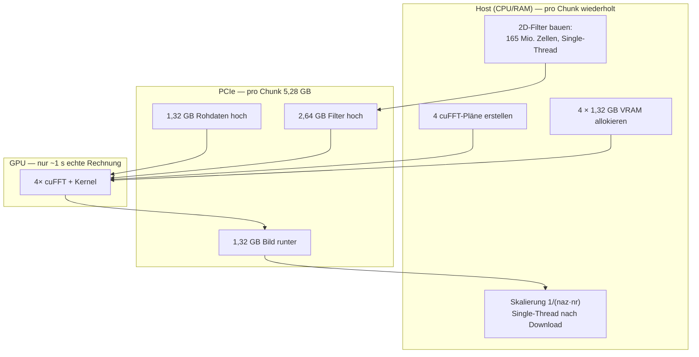
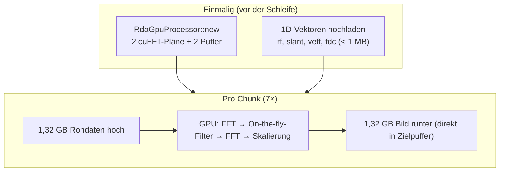
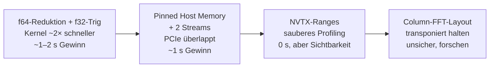

# Walkthrough: GPU-Beschleunigung der SAR-Fokussierung

> **Kurzfassung:** Die GPU-Fokussierung war langsamer als die CPU (Vollrahmen:
> 92 s gegen 67 s), weil sie pro Chunk riesige Filtermatrizen auf der CPU
> berechnete, über PCIe schob und alle Pläne neu aufbaute. Jetzt berechnet die
> GPU jede Filterphase direkt im Kernel aus winzigen 1D-Vektoren, Pläne und
> Puffer leben über alle Chunks — **Vollrahmen-Fokus in 10,8 s statt 92,2 s**
> (8,5× schneller, 6× schneller als die CPU), bei bis auf Rundung
> identischen Bildern (Abweichung ~1e-7).

---

## 0. Begriffe in Kürze

Wer nicht täglich mit Radar zu tun hat, braucht nur diese fünf Ideen:

- **SAR-Fokussierung:** Ein Radar-Satellit (hier Sentinel-1) sendet tausende
  Pulse und empfängt Echos. Jedes Echo enthält Beiträge vieler Bodenpunkte
  durcheinander. „Fokussieren" heißt: per Signalverarbeitung (Chirp-Kompression
  + Azimut-Filter) jedem Pixel seine Energie zurückgeben — das unscharfe
  Rohbild wird ein scharfes Radarbild.
- **RDA (Range-Doppler-Algorithmus):** Der klassische Lösungsweg über
  Fourier-Transformationen (FFTs): Range-FFT → Azimut-FFT → Filter
  multiplizieren → zurücktransformieren. Vier FFT-Stufen, zwei Filter.
- **RCMC (Range-Cell-Migration-Correction):** Korrektur dafür, dass ein Ziel
  während des Überflugs durch mehrere Entfernungszellen „wandert". Ein
  Phasenfilter im 2D-Frequenzbereich.
- **Chunk / Overlap-Save:** Der Vollrahmen (44.901 Echos × 20.160 Samples)
  wird in Azimut-Stücke (Chunks à 8.192 Echos) geschnitten, weil ein Stück
  dieser Größe optimal in den GPU-Speicher passt und glatte FFT-Längen hat.
  Jeder Chunk überlappt den Nachbarn (Overlap 2.048); die Ränder werden
  verworfen, die sauberen Mitten zusammengesetzt.
- **cuFFT-Plan:** NVIDIAs FFT-Bibliothek „plant" vor der ersten Rechnung, wie
  sie eine FFT-Geometrie am schnellsten rechnet (etwa: welche Zerlegung, wie
  viel Zwischenspeicher). Diese Planung kostet Zeit — man macht sie einmal,
  nicht siebenmal.

---

## 1. Was exakt implementiert wurde

### 1.1 Das Problem (vorher)



Drei Bremsen fraßen ~90 Sekunden: die CPU-Filterberechnung (~35 s), das
Planen und Allokieren je Chunk (~15 s) sowie serielle PCIe-Transfers von
insgesamt ~37 GB (~30 s). Die reine GPU-Rechenzeit lag längst unter einer
Sekunde.

### 1.2 Die Lösung (nachher)



Vier konkrete Änderungen in vier Dateien (306 eingefügte, 124 gelöschte
Zeilen):

**a) On-the-fly-Filter (`sar_focus/src/09_kernel.rs`, neu: `range_rcmc`,
`cmul_az`).** Statt zwei 2D-Filtermatrizen (je 1,32 GB) zu speichern,
berechnet jeder GPU-Thread die Phase seiner Zelle `(a, r)` selbst in
Registern — exakt die CPU-Formeln aus `06_rda`:

```rust
// Pro Zelle: fa aus Indexformel, D-Faktor, Phase in f64 —
/// exakt wie rda::d_factor + rda::rcmc_filter auf der CPU.
let fa = (f64::from(a) - f64::from(naz / 2)) * prf_hz / f64::from(naz);
let fd = fa - fdc[ri];
let x = lambda_m * lambda_m * fd * fd / (4.0 * v * v);
let dd = (1.0 - x.min(1.0)).sqrt();          // Migrationsfaktor D
let shift = r0_m * (1.0 / dd - 1.0);
let ph = 4.0 * core::f64::consts::PI * fr * shift / c_m_s;
filt = filt * Complex32::new(ph.cos() as f32, ph.sin() as f32);
```

Hochgeladen werden nur noch vier 1D-Vektoren (zusammen unter 1 MB) statt
2,64 GB Filter — die CPU-Vorbereitung pro Chunk entfällt vollständig.

**b) Persistenter Prozessor (`sar_focus/src/main.rs`, `10_gpu.rs`).**
`RdaGpuProcessor::new` steht jetzt **vor** der Chunk-Schleife; alle Chunks
haben garantiert volle Größe (der letzte wird zurückgeschoben, per
`debug_assert` bewacht). Zusätzlich schrumpften 4 cuFFT-Pläne auf 2, weil
die FFT-Richtung ein Ausführungsparameter ist, kein Planbestandteil:

```rust
// Einmalig: Pläne + Puffer leben über alle Chunks.
let mut proc = sar_focus::gpu::RdaGpuProcessor::new(&p)?;
for (ci, &cs) in starts.iter().enumerate() {
    // ...
    proc.focus(&mut buf)?;   // nur noch Upload → FFT/Kernel → Download
}
```

**c) Nacharbeit auf die GPU (`10_gpu.rs`, neuer `scale`-Kernel).** Die
Single-Thread-Skalierung `1/(naz·nr)` über 165 Mio. Zellen läuft nun als
GPU-Kernel, und der Download schreibt per `copy_to_host` direkt in den
Zielpuffer — kein Zwischen-`Vec`, kein `copy_from_slice` mehr.

**d) Bereinigung + Regressionstest.** Die überflüssig gewordenen Kernel
`cmul_2d`/`cmul_row` samt Launchern wurden ersatzlos gestrichen (~90 Zeilen
weniger). Neu ist `rda_gpu_stimmt_mit_cpu_schief` in
`sar_focus/tests/gpu_compare.rs`: Er vergleicht GPU-gegen-CPU mit
**Rampen** in `fdc`/`veff` (statt Konstanten) und je mit/ohne RCMC — nur so
fällt ein Indexfehler in den 1D-Vektoren überhaupt auf.

### 1.3 Messergebnisse (Release, RTX A4000, 32 CPU-Kerne, S6-VV-Echtdaten)

Fokus-Zeiten (ohne Dekodierung/Quicklook):

| Fall | CPU | GPU vorher | GPU nachher | Schneller als vorher | GPU vs. CPU |
|---|---|---|---|---|---|
| 2.048 Echos (1 Chunk) | 2,8 s | 3,6 s | **0,7 s** | 5,1× | 4,0× |
| 8.192 Echos (1 Chunk) | 11,3 s | 13,6 s | **1,9 s** | 7,2× | 5,9× |
| Vollrahmen 44.901 (7 Chunks) | 66,5 s¹ | 92,2 s¹ | **10,8 s** | 8,5× | 6,2× |

¹ Aus dem Vorprojekt, identischer Code und identische Maschine.

Gesamtlaufzeit Vollrahmen: 121,2 s → **38,7 s** (die Dekodierung mit
27,7 s dominiert jetzt — der Fokus ist kein Engpass mehr). Host-RAM-Spitze
beim 8.192er-Chunk: 9,19 GB → **4,04 GB**. PCIe-Volumen Vollrahmen:
~37 GB → **~18,5 GB** (nur noch Rohdaten hoch, Bild runter). VRAM pro
Chunk: 5,3 GB → **2,6 GB**.

Nsight-Systems-Profil eines 2.048er-Chunks (41 Mio. Zellen): GPU-Kernel
gesamt ~78 ms (`range_rcmc` 33 ms, `cmul_az` 27 ms, cuFFT ~11 ms,
Shifts/Skalierung ~7 ms), PCIe 33 ms (328 MB je Richtung, ~20 GB/s).
Die Fusions-Kernel sind also f64-transzendentenlimitiert (je Zelle
`sqrt`+`sin`+`cos`) — dazu mehr unter Erweiterungen.

### 1.4 Validierung (nichts wurde „schnell und falsch")

- **Unit-/Integrationstests:** `cargo oxide test` 48/48 grün (34 lib +
  14 Integration, inkl. neuem Schief-Test), Decoder-Crate 41/41 grün
  (inkl. 3 Echtdaten-Regressionen direkt auf der `.dat`-Datei).
- **Gates:** `cargo clippy --all-targets -- -D warnings` und
  `cargo fmt --check` in beiden Crates grün; `cargo upgrade --dry-run`
  meldet alle Deps aktuell (CUDA-Rev bewusst gepinnt).
- **Bildvergleich Echtdaten alt-gegen-neu** (Peak-normiert): max. relative
  Abweichung 1,3e-7 (2.048er) bzw. 1,1e-7 (8.192er) — reine
  Gleitkomma-Rundung bei 1e-3-Schranke, also vier Größenordnungen Luft.
- **`--compare`-Sensor:** CPU↔GPU-Abweichung 2,620e-7 **vor und nach** dem
  Umbau identisch — der Umbau hat das Ergebnis bitnah nicht verändert.

---

## 2. Architektur-Entscheidungen, die Tests und Messungen erzwangen

Vier Punkte liefen anders als im `review.md`-Entwurf — jeweils mit Messung
begründet:

### 2.1 Overlap bleibt 2.048 (statt 1.024)

Das Review schlug Overlap 1.024 vor (physikalisch ~1.000 Pulse Apertur,
„7→6 Chunks, 15 % gespart"). Die Messung widerlegte die Arithmetik: Bei
44.901 Echos ergeben **beide** Overlaps 7 Chunks (10,8 s vs. 10,8 s),
weil 35.840 + 8.192 = 44.032 den Rahmen hauchdünn verfehlt und einen
siebten, fast vollständig redundanten Chunk erzwingt. 6 Chunks bräuchten
Overlap ≤ 850 — unterhalb der physikalischen Apertur. Zudem weichen die
beiden Overlap-Einstellungen in gemeinsam validen Zentren um 1,1e-4 voneinander
ab (klein, aber messbar — Chunkungseinfluss ist real). **Entscheidung:**
Default 2.048 behalten, kein messbarer Nachteil, mehr Schutzabstand.

### 2.2 Kein Double-Buffering / Streaming

Das Review empfahl zwei CUDA-Streams mit überlapptem PCIe-Transfer. Das
Profil zeigt: PCIe kostet 33 ms pro 2.048er-Chunk — der Transfer ist nach
dem Filter-Wegfall **kein Engpass** mehr. Streaming hätte ~1 s auf 10,8 s
gebracht, bei deutlich komplexerer Buchhaltung (Stream-gebundene
cuFFT-Pläne, Overlap-Save mit zwei fliegenden Chunks). **Entscheidung:**
bewusst weggelassen, als dokumentierte Erweiterung (Abschnitt 3.2).

### 2.3 Phasen bleiben `f64` im Kernel (kein `f32`-Shortcut)

Verlockend wäre: Trigonometrie in `f32` rechnen, doppelt so schnell. Aber
die Azimut-Phase `4π·R·D/λ` erreicht ~2e8 Radiant — `f32` (24-Bit-Mantisse)
quantisiert dort in 16-Radiant-Schritten und würde das Bild total
zerstören. Die Argumentreduktion **muss** in `f64` passieren (wie auf der
CPU). Erst danach dürfte man auf `f32`-Trig wechseln — siehe Erweiterung.

### 2.4 Ungerades Testgitter als Wachhund

Die Testgeometrie (1.025 × 4.097, ungerade!) prüft implizit die
`div_ceil`-Zweige der `fr`-Formel und die Shift-Asymmetrie
(`ceil` vs. `floor` bei `fftshift`/`ifftshift`). Der neue Schief-Test läuft
auf genau diesem Gitter — ein Off-by-one in den Indexformeln der Kernel
wäre sofort rot. TDBP blieb unangetastet (eigener Engpass, eigene Aufgabe).

---

## 3. Learnings und mögliche Erweiterungen

### 3.1 Learnings

1. **Profilieren schlägt Schätzen.** Das Review taxierte „~0,8–1,2 s echte
   GPU-Rechnung" und 30 s PCIe. Gemessen: PCIe nur ~1 s, dafür Filter-Build
   und Planung ~50 s. Ohne Messung hätte man am falschen Ende optimiert.
2. **Der `--compare`-Wert ist ein empfindlicher Änderungssensor.**
   Dass CPU↔GPU vorher wie nachher exakt 2,620e-7 meldet, ist der billigste
   Korrektheitsbeweis des Umbaus — jede Formelabweichung hätte ihn bewegt.
3. **Chunk-Arithmetik nachrechnen, nicht schätzen.** „Overlap halbieren
   spart einen Chunk" klingt plausibel und ist hier falsch (7→7). Die
   Starts-Logik mit zurückgeschobenem letztem Chunk hat Ecken, die man
   ausrechnen muss.
4. **Determinismus ist ein Geschenk:** `f32`-Grundrechenarten sind
   IEEE-exakt über Plattformen hinweg — deshalb sind Alt und Neu bis auf
   ~1e-7 identisch und der Vergleich so scharf.

### 3.2 Mögliche Erweiterungen (nach Aufwand sortiert)



- **Kurzfristig:** Phase in `f64` auf `[0, 2π)` reduzieren, dann
  `f32`-`sin`/`cos` — halbiert die dominante Kernelzeit (~60 ms → ~30 ms
  je 2.048er-Chunk), Wirkung am Vollrahmen ~1–2 s. Sorgfältig gegen die
  1e-3-Schranke validieren.
- **Mittelfristig:** Pinned Host Memory + zwei Streams (Review-Punkt C
  nachholen), sobald der Rest klein genug ist, dass 1 s zählt. NVTX-Ranges
  um Upload/FFT/Kernel/Download legen, damit das nächste Profil ohne Raten
  auskommt.
- **Forschen:** Spalten-FFTs mit Schrittweite 20.160 lesen strided —
  prüfen, ob ein transponiertes Persistenz-Layout (Chunk einmal
  transponieren, alles kontiguierlich) die cuFFT-Stufen beschleunigt.
  Vorsicht: Jede Transposition kostet selbst Bandbreite.

---

## 4. Neue Programme für das Dockerfile

Bei dieser Aufgabe musste genau **ein** Paket nachinstalliert werden; der
Rest war bereits vorhanden und sollte nur festgeschrieben werden:

| Paket/Programm | Zweck | Bemerkung |
|---|---|---|
| `libclang-dev` | `bindgen` (via `cuda-bindings`-Build) braucht `libclang.so` | **Neu aufnehmen!** Sonst schlägt jeder `cargo`-Build fehl. Ggf. `LIBCLANG_PATH=/usr/lib/llvm-21/lib` setzen. |
| CUDA-Toolkit 13.4 (`nvcc`, `libcufft`, `libNVVM`/`nvJitLink`) | Kernel-Build, FFT, Geräte-Link | Bereits im Image; Version pinnen. |
| Nsight Systems (`nsys`) / Nsight Compute (`ncu`) | GPU-Profiling (Abschnitt 1.3) | Bereits vorhanden (`/usr/local/bin/nsys`); im Image behalten. |
| `cargo-oxide` 0.2.1 + Nightly `nightly-2026-08-28` | Rust-GPU-Builds (`cargo oxide build/test`) | Bereits vorhanden; Toolchain im Image vorhalten (sonst Auto-Download beim ersten Build). |
| Python 3 + `numpy` | `.cf`-Bildvergleiche (Auswertung, kein Build) | Optional; nur für Benchmark-Auswertung nötig. |

Nicht aufgenommen: `cargo-edit` (`cargo upgrade`) war bereits installiert
und meldete alle Abhängigkeiten aktuell — kein Pin geändert, insbesondere
die `cuda-oxide`-Revision `a0cc6cc` bleibt aus Stabilitätsgründen gepinnt.

---

*Artefakte dieser Aufgabe: `prompt.txt` (Aufgabe), `review.md` (Befund),
`plan.md` (ausführbarer Plan + Commit-Konvention), `plan_effort.md`
(Aufwand), dieses Dokument. Commits wurden bewusst nicht ausgeführt —
der Stand liegt zur Durchsicht uncommittet vor (4 geänderte Dateien,
siehe `git status`).*
