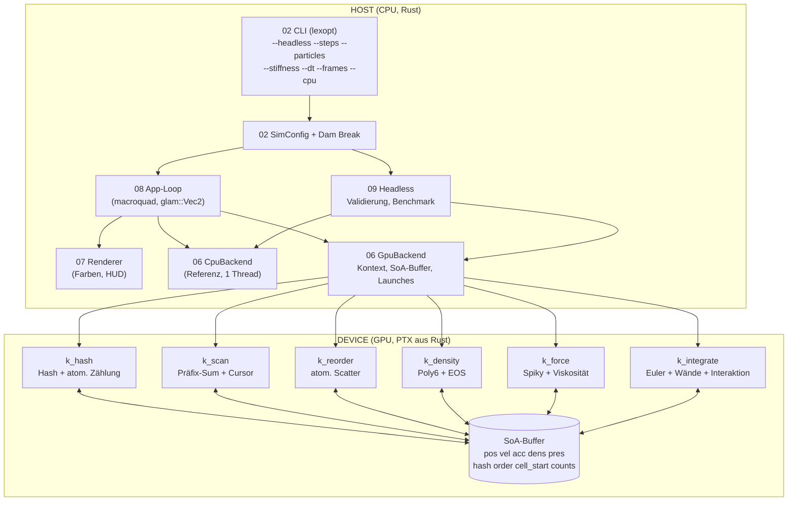
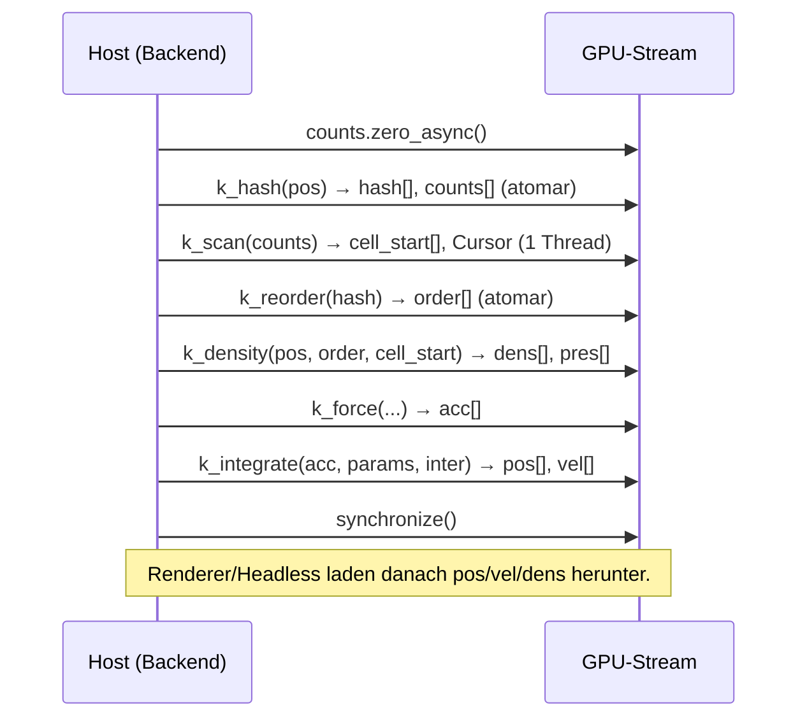
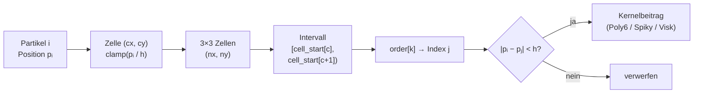

# Walkthrough: GPU-SPH-Fluidsimulation mit cuda-oxide (35_sph)

Ziel war eine echtzeitfähige, GPU-beschleunigte 2D-Fluidsimulation nach dem
SPH-Verfahren mit interaktiver X11-Visualisierung. Alle Physikkerne sind in
nativem Rust geschrieben und werden mit `cuda-oxide` zu PTX übersetzt. Dieses
Dokument erklärt, was gebaut wurde, welche Entscheidungen unterwegs kippten
und was als Nächstes anstünde.

## Begriffsklärung (kurz)

- **SPH (Smoothed-Particle Hydrodynamics):** Verfahren, das ein Fluid als
  Wolke von Partikeln modelliert. Jedes Partikel trägt Masse,
  Geschwindigkeit, Dichte und Druck; Feldgrößen entstehen durch gewichtete
  Mittelung über Nachbarpartikel.
- **Smoothing Kernel (Glättungskern):** Gewichtsfunktion W(r, h), die den
  Einfluss eines Nachbarn im Abstand r bewertet. Außerhalb des
  **Glättungsradius h** ist sie exakt null — nur nahe Partikel zählen.
  Hier: **Poly6** (Dichte), **Spiky-Gradient** (Druckkräfte),
  **Viskositäts-Laplacian** (innere Reibung).
- **Zustandsgleichung (EOS):** Rechenvorschrift Druck-aus-Dichte. Hier die
  einfache Form P = k·(ρ − ρ₀) mit Gas-Steifigkeit k (verwandt mit der
  **Tait-Gleichung**, die in der Originalform P = B·((ρ/ρ₀)^γ − 1) lautet
  und Wasser als schwach kompressibel beschreibt).
- **Spatial Hashing (Uniform Grid):** Beschleunigungsstruktur: Die Domäne
  wird in Zellen der Größe h geteilt, jedes Partikel landet per Hash in
  genau einer Zelle. Nachbarn stehen dann nur in der eigenen plus den acht
  umliegenden Zellen — statt O(N²) kostet die Suche noch O(N).
- **PTX (Parallel Thread Execution):** Zwischensprache, in die CUDA-Kernel
  übersetzt werden; der GPU-Treiber kompiliert sie zur Laufzeit in
  Maschinencode (hier via `libNVVM`/`nvJitLink`).
- **DisjointSlice:** cuda-oxide-Typ für datenrennfrei parallele
  Schreibzugriffe: Jeder GPU-Thread darf nur „sein" Element schreiben,
  geprüft zur Compilezeit per `ThreadIndex`-Zeugen.

---

## 1. Was exakt implementiert wurde

### 1.1 Projektstruktur (Single-Source-Crate)

Entgegen dem ursprünglichen Workspace-Entwurf (Host-/Kernel-Crates) liegt
alles in **einem** Crate: cuda-oxide kompiliert `#[kernel]`-Funktionen aus
derselben Datei nach PTX (Single-Source-Prinzip). `main.rs`/`lib.rs`
enthalten nur Verdrahtung; die Logik liegt in nummerierten Dateien:

| Datei | Modul | Verantwortung | Zeilen |
|---|---|---|---|
| `src/01_types.rs` | `types` | `Particle`, `SphParams`, `InteractParams`, `GridMeta` (alle Pod) | ~180 |
| `src/02_params.rs` | `params` | `SimConfig`-Defaults, lexopt-CLI, Dam-Break-Init | ~300 |
| `src/03_sph_math.rs` | `sph_math` | Gerätekompatible Kernelfunktionen + Unit-Tests | ~150 |
| `src/04_spatial_grid.rs` | `spatial_grid` | Hash-Funktion, CPU-Counting-Sort, Nachbariteration | ~210 |
| `src/05_gpu_kernels.rs` | `gpu_kernels` | `#[cuda_module]` mit sechs Kernen (nur `gpu`-Feature) | ~330 |
| `src/06_backend.rs` | `backend` | `Backend`-Trait, `GpuBackend`, `CpuBackend` | ~430 |
| `src/07_renderer.rs` | `renderer` | macroquad-Zeichnung, Kamera, Farbmodi, HUD | ~230 |
| `src/08_app.rs` | `app` | Event-Loop, Maus/Tasten, Sub-Steps | ~170 |
| `src/09_headless.rs` | `headless` | Headless-Runner, Validierung, Benchmark-Bericht | ~170 |
| `tests/` | — | `sph_math`, `spatial_grid`, `cpu_stability` (9 Tests) | — |
| `benches/` | — | CPU-Durchsatzbank (`harness = false`) | — |

> Hinweis: `05_gpu_kernels.rs` und `06_backend.rs` überschreiten die
> 300-Zeilen-Richtmarke leicht; beide haben genau eine Zuständigkeit
> (Device-Kerne bzw. Backend-Trait mit beiden Implementierungen), eine
> weitere Teilung hätte die spiegelbildliche CPU/GPU-Paarung zerrissen.

### 1.2 Systemarchitektur



### 1.3 Datenfluss eines Zeitschritts



### 1.4 GPU-Grid-Lookup (Nachbarsuche)



Jeder Thread bearbeitet genau ein Partikel i; alle Zugriffe auf fremde
Partikel laufen über die sortierte `order`-Liste, wodurch räumlich nahe
Partikel auch im Speicher benachbart liegen (Cache-/Coalescing-freundlich).

### 1.5 Physik (verbindliche Defaults)

- N = 16 384 (CLI: 2 048–262 144), ρ₀ = 1000 kg/m³, h = 0,04 m,
  k = 2000, μ = 0,1 Pa·s, g = 9,81 m/s², dt = 0,0008 s, 3 Sub-Steps/Frame.
- Domäne 1,6 × 1,0 m, Wanddämpfung 0,5, Hinderniskreis r = 0,08 m.
- Druck P = k(ρ − ρ₀), negativ auf 0 geklemmt (keine Klumpen-Instabilität).
- Symplectic Euler (erst v, dann x), Geschwindigkeits-Cap 12 m/s.

Beispiel — der Dichte-Kern (Ausschnitt, läuft als PTX auf der GPU):

```rust
#[kernel]
#[launch_bounds(256)]
#[launch_contract(domain = 1, block = (256, 1, 1))]
pub fn k_density(
    pos: &[[f32; 2]], order: &[u32], cell_start: &[u32],
    params: SphParams,
    mut dens: DisjointSlice<f32>, mut pres: DisjointSlice<f32>,
) {
    let i = thread::index_1d().get();
    if i >= params.num_particles as usize { return; }
    // ... 3×3-Zellschleife, Poly6 aufsummieren ...
    rho *= poly6_coef(h) * params.mass;
    *dens.get_mut(thread::index_1d()).unwrap() = rho; // Schema, echt: let-else
}
```

### 1.6 Interaktivität (alle Feature-Sets umgesetzt)

- Dam Break als Initialzustand (gestaffeltes Gitter links).
- Hindernis folgt der Maus (in Domäne geklemmt).
- Linksklick: Wirbel (tangentiale Kraft, Radius 0,2 m, Cyan-Ring).
- Rechtsklick: Strahl (96 Partikel/Frame werden an der Maus recycelt).
- `R` Reset, `Space` Pause an/aus, `S` Einzelschritt bei Pause,
  `G` Gravitation an/aus, `C` Farbmodus (Geschwindigkeit/Dichte),
  `Esc` Beenden. `--frames N` beendet die GUI nach N Frames (Smoke-Test).

### 1.7 Validierung, Tests, Benchmarks

- `cargo test`: 25 Tests (16 Unit + 9 Integration), alle grün.
- Headless-GPU-Lauf: 500 Schritte PASS (kein NaN/Inf, kein Tunneln,
  Dichte in (0, 5ρ₀]).
- CPU/GPU-Parität: ρ̄ 930,7 vs. 926,5 (0,5 %, Float-Summationsreihenfolge).
- GUI-Smoke: 120 Frames bei ~60 FPS auf dem Host-X-Server.
- Durchsatz RTX A4000 (500 Schritte, `--bench`):

| N | GPU ms/Schritt | GPU Partikel/s | CPU Partikel/s | Speedup |
|---|---|---|---|---|
| 2 048 | 0,17 | 12,2 Mio | 2,7 Mio | 4,6× |
| 16 384 | 0,74 | 22,0 Mio | 0,47 Mio | 47× |
| 65 536 | 6,15 | 10,7 Mio | — | — |
| 262 144 | 128,0 | 2,0 Mio | — | — |

Der Einbruch bei großem N ist Physik, kein Bug (siehe 2.6).

---

## 2. Spontan geänderte Architektur-Entscheidungen

### 2.1 SoA statt AoS auf der GPU (Disjoint-Aliasing)

Der Blueprint sah ein `Particle`-Struct-Array auf dem Device vor. Das
scheitert an `DisjointSlice`: Innerhalb eines Kernels darf derselbe Buffer
nicht gleichzeitig gelesen und geschrieben werden. Lösung: acht
SoA-Buffer (`pos`, `vel`, `acc`, `dens`, `pres`, `hash`, `order`,
`cell_start`, `counts`); das AoS-`Particle` lebt nur noch hostseitig
(Init, CPU-Backend, Tests).

### 2.2 `cuda-core` aus Git statt crates.io (E0277/E0308)

Das `cargo-oxide`-Template mischt `cuda-device`/`cuda-host` aus Git mit
`cuda-core` 0.4.0 von crates.io — zwei verschiedene Crate-Instanzen, die
Typ-Unifikation schlägt fehl. Fix (wie im Schwesterprojekt
`32_cuda-rust/my_first_kernel`): alle drei aus derselben gepinnten
Git-Revision (`a0cc6cc…`).

### 2.3 Prepared-Launcher statt Direkt-Launch

Die Repo-Beispiele nutzen `module.k(stream.as_ref(), LaunchConfig{…})`,
die installierte Makro-Version erzeugt aber nur den Prepared-Stil
(`prepare_k_*` + typisierter Launch). Nach einem Fehlversuch umgestellt —
der Prepared-Stil validiert zusätzlich Shape und Launch-Kontrakt.

### 2.4 Der ρᵢ-Bug: Druck 1000× zu schwach (Kollaps statt Fluid)

Schwerster Fehler der Session: Im Druckterm fehlte der Faktor ρᵢ.
Die Spec-Formel lautet F = −ρᵢ·m·pterm·∇W mit a = F/ρᵢ; der Code
berechnete F ohne ρᵢ und teilte trotzdem durch ρᵢ — die Abstoßung war
~1000× zu schwach. Symptom: Der Damm kollabierte unter Gravitation
(ρ bis 9,5×ρ₀), unabhängig von k. Diagnoseweg: k-Sweep (200–2000) ohne
Besserung → Kraftbilanz nachgerechnet → Fix in GPU-Kernel **und**
CPU-Spiegel identisch. Danach: PASS, ρ̄ = 630 bei t = 0,4 s (Aufprall),
Anfangszustand exakt (ρ̄ = 974 ≈ ρ₀).

### 2.5 `gpu`-Feature-Gate (Link-Anker vs. `cargo test`)

`cargo test` baut **immer** auch das Binär (für `CARGO_BIN_EXE`), doch der
Binär-Link braucht den Geräte-Anker, den nur das Oxide-Backend emittiert.
Anfängliches „Wegstrippen" ungenutzter Symbole erwies sich als fragil
(Link brach nach harmlosen Edits). Robuste Lösung: `gpu` ist ein
Nicht-Default-Feature, das Binär hat `required-features = ["gpu"]`, alle
GPU-Referenzen sind `cfg`-gated. Plain `cargo test`/`cargo clippy` prüfen
CPU-Code; `cargo clippy --all-targets --features gpu` (linkt nicht) prüft
den Rest; Oxide-Läufe brauchen `--features gpu`.

**Nachtrag (CPU-only-Folgeauftrag):** Die cuda-Crates sind nun zusätzlich
*optionale* Dependencies (`gpu = ["dep:cuda-device", …]`), `required-features`
am Binär entfiel. Damit baut und läuft das Projekt auf Systemen ohne GPU
und ohne CUDA-Toolkit (`cargo build`, `cargo run -- --headless --cpu`);
zuvor scheiterte schon das Kompilieren an `cuda-bindings` (bindgen gegen
`cuda.h`). Nachweis: `cargo tree` ohne Feature enthält 0 cuda-Knoten, der
Verbose-Build ruft keine cuda-Build-Skripte auf.

### 2.6 Skalierungs-Ehrlichkeit: Nachbarzahl wächst mit N

Bei festem h = 0,04 m und wachsendem N sinkt der Partikelabstand s, also
wächst die Nachbarzahl pro Partikel ∝ (h/s)² ∝ N — Gesamtaufwand ∝ N².
Bei N = 262 144 hat jedes Partikel ~2100 Nachbarn (128 ms/Schritt).
Physikalisch korrekt, aber langsam; Standard-Gegenmittel wäre h ∝ s.
Bewusst nicht umgesetzt (Spec fixiert h), dafür dokumentiert.

### 2.7 Software-Rasterisierung im Container (MIT-SHM)

Der direkte GL-Pfad stürzt mit `BadShmSeg` ab: Container und Host-X-Server
teilen kein IPC (`/dev/shm`), MIT-SHM kann nicht funktionieren. Mit
`LIBGL_ALWAYS_SOFTWARE=1` rendert llvmpipe stabil bei ~60 FPS über
`DISPLAY=:0`. Die Physik läuft ohnehin auf der GPU (CUDA direkt); nur die
Rasterung von 16k Rechtecken übernimmt die CPU — für diese Last irrelevant.
Echte Lösung: Container mit `--ipc=host` starten oder NVIDIA-GL-Libs
passend zum Host-Treiber (610.x) einbauen.

### 2.8 Kleinere Belegungen

- Blockgröße 256 statt 512 (mehr Register für Nachbarschleifen; „bis 512"
  bleibt erfüllt).
- `Space` = Pause-Toggle, `S` = Einzelschritt (statt mehrdeutigem
  „Pause/Step" auf einer Taste); steht so im HUD.
- Hindernis folgt der Maus passiv; Klicks legen Wirbel/Strahl darüber.

---

## 3. Learnings und zukünftige Optimierungen

**Learnings.**

1. Single-Source-GPU braucht Disziplin bei der Testtrennung: Was der
   Geräte-Anker berührt, darf plain nicht erreichbar sein — per Feature,
   nicht per Hoffnung auf Dead-Code-Eliminierung.
2. Der wertvollste Test war kein Unit-Test, sondern der k-Sweep über den
   Headless-Runner: Er trennte „falsche Physik-Konstanten" von „falscher
   Formel" in zwei Läufen.
3. CPU/GPU-Parität (0,5 %) ist die billigste Versicherung gegen
   Grid-Bugs: Beide Backends teilen sich nur die Mathematik, nicht den Code.

**Zukünftige Optimierungen.**

- **3D:** Kerne sind dimensionsnah geschrieben (nur Nachbarschleife und
  Normierungen ändern sich); Zella
...[truncated 2379 chars]