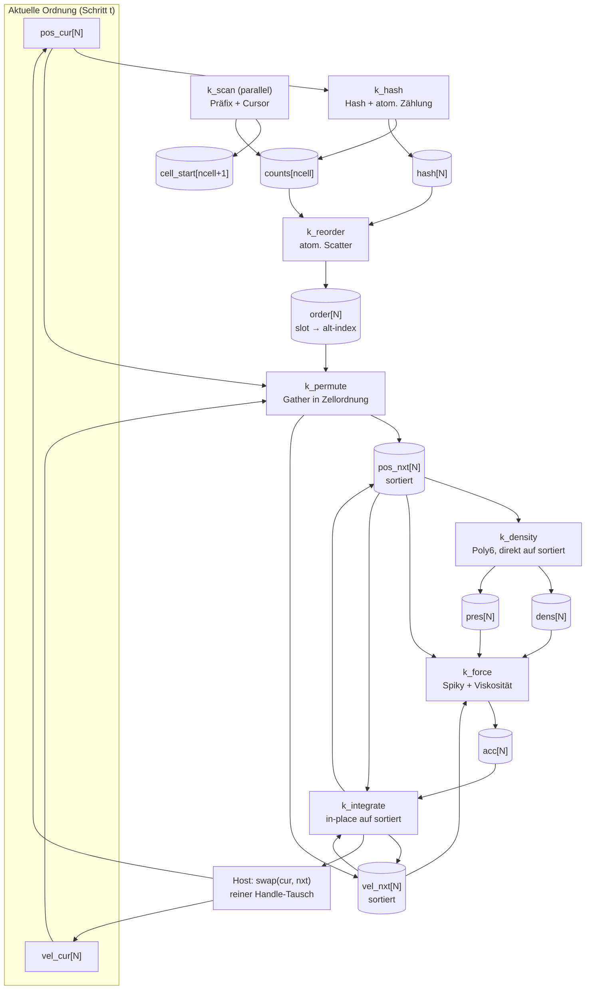
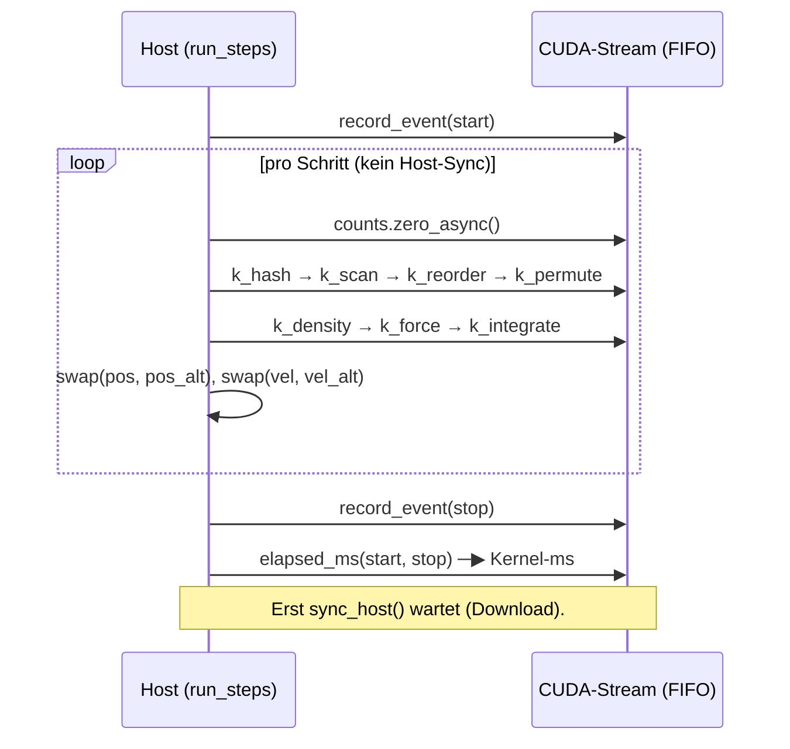

# Walkthrough: GPU-Performance-Optimierung des SPH-Solvers (P1–P4)

Alle vier Review-Hebel sind umgesetzt, alle Gates grün. Der Solver rechnet
auf der RTX A4000 bei N = 16.384 jetzt **0,28 ms/Schritt (59,3 MIUPS)**
statt 0,73 ms (22,4 MIUPS) — **2,7× schneller**, Zielbereich < 0,30 ms
erreicht. Dieses Dokument erklärt, was sich geändert hat, warum es
schneller wurde und wie es gemessen wurde.

## 1. Ergebnis im Überblick

### 1.1 Vorher–Nachher (200 Schritte, identische Methodik)

| N | Vorher ms/Schritt | Nachher ms/Schritt | Speedup | Vorher MIUPS | Nachher MIUPS |
|---|---|---|---|---|---|
| 2.048 | 0,1699 | 0,0675 | **2,52×** | 12,06 | 30,36 |
| 16.384 | 0,5420 | 0,2899 | **1,87×** | 30,23 | 56,51 |
| 65.536 | 2,7800 | 1,9241 | **1,44×** | 23,57 | 34,06 |
| 262.144 | 36,2575 | 22,4057 | **1,62×** | 7,23 | 11,70 |

### 1.2 Stufenweise Zerlegung (500 Schritte, N = 16.384)

| Stand | ms/Schritt | MIUPS | Bemerkung |
|---|---|---|---|
| Nach P2 (sync-frei + Events) | 0,7329 | 22,35 | Entspricht der alten Baseline (~0,74 / 22,0) |
| + P1 (sortierte Puffer) | 0,3683 | 44,48 | **2,0×** durch Koaleszierung |
| + P3 (paralleler Scan) | 0,2762 | 59,32 | weitere **1,33×**, Ziel < 0,30 erreicht |

Gesamt: **2,65×** bei 500 Schritten. Die CUDA-Event-Kernelzeit liegt
innerhalb von 0,001 ms an der Wallclock — nach P2 steckt praktisch keine
Host-Latenz mehr in der Messung.

### 1.3 Stabilität & Parität

- `cargo oxide run --features gpu -- --headless --steps 500`: **PASS**
  (kein NaN/Inf, kein Tunneln, Dichte in (0, 5ρ₀]).
- Dichtemittel vorher/nachher (200 Schritte): 932,1→928,4 (N=2k),
  947,5→947,5 (N=16k, identisch), 950,5→951,2 (N=64k), 924,3→917,4
  (N=256k) — Abweichungen ≤ 0,7 % durch Fließkomma-Summationsreihenfolge.
- GUI-Smoke (`DISPLAY=:0`, 120 Frames): PASS, 67–84 FPS.
- Gates: `cargo fmt --check`, beide `cargo clippy -- -D warnings`,
  `cargo test` (25 Tests) — alle grün.

## 2. Was sich geändert hat

### 2.1 P1 — Physikalisch sortierte Partikelpuffer (Ping-Pong)

**Problem:** `k_density`/`k_force` lasen Nachbarn über `pos[order[k]]`
(doppelter Gather). Sobald das Fluid fließt, bearbeiten Threads eines
Warps räumlich verstreute Partikel: divergierende Zellschleifen plus
unkoaleszierte Loads (Cache-Thrashing).

**Lösung (Schema der NVIDIA-Particles-Referenz):** Nach Zählung und Scan
permutiert ein neuer Kernel `k_permute` die SoA-Puffer physikalisch in
Zellordnung (`pos_nxt[s] = pos_cur[order[s]]`, ein Gather mit
koaleszierenden Writes). Thread `i` bearbeitet danach das *sortierte*
Partikel `i`; Nachbarn kommen aus zusammenhängenden Intervallen:

```rust
// Vorher (05_gpu_kernels.rs): doppelte Indirektion
let j = order[k] as usize;
let qx = pi[0] - pos[j][0];
// Nachher: direkter Zugriff auf sortierte Puffer
let pj = pos[k];
let qx = pi[0] - pj[0];
```

`k_integrate` aktualisiert die sortierten Puffer in-place (weiter
`DisjointSlice`, keine Scatter nötig); der Host tauscht danach die
Ping-Pong-Handles (`std::mem::swap`, kein Copy). `dens`/`pres`/`acc`
leben immer in der neuen Sortierordnung und brauchen keinen Doppelpuffer.
Kosten: zwei zusätzliche N×[f32;2]-Buffer (bei N=262k je 2 MiB) plus ein
Gather pro Schritt — die heißen Schleifen (Dichte/Kraft) werden dafür
vollständig koaleszierend und divergenzfrei. Effekt: ~2× (s. §1.2).

### 2.2 P2 — Sync-freies Multi-Substepping

`GpuBackend::step()` endete mit `stream.synchronize()` — bei 3
Sub-Steps/Frame und 500 Headless-Schritten hundertfacher Treiber-Stopp.
Der Call ist ersatzlos gestrichen: Der CUDA-Stream ist FIFO-geordnet,
Kernel und `zero_async` laufen garantiert sequenziell. Synchronisiert wird
nur noch beim Host-Download in `sync_host()` (jedes `copy_to_host` wartet
ohnehin, verifiziert in `cuda-core`) und an Messpunkten. Die GUI profitiert
automatisch (3 Steps → 1 Sync pro Frame).

### 2.3 P3 — Kooperativer Block-Scan im Shared Memory

**Problem:** `k_scan` parkte 255 von 256 Threads; ein Thread summierte
seriell über alle Zellen (3.000 globale Atomar-Ops bei 1.000 Zellen —
nach P1 plötzlich ~25 % der Schrittzeit!).

**Lösung:** Chunk-Scan mit allen 256 Threads und 1 KiB Shared Memory
(`SharedArray<u32, 256>`, `thread::sync_threads()`, `thread::threadIdx_x()`):

1. Jeder Thread summiert sein Chunk (`ceil(ncell/256)` Zellen) → Shared.
2. Thread 0 bildet den exklusiven Präfix über die 256 Chunk-Summen.
3. Jeder Thread schreibt den exklusiven Scan seines Chunks nach
   `cell_start` und initialisiert den `counts`-Cursor; Thread 0 schreibt
   das Total.

Der Scan skaliert damit auf beliebiges `ncell` (feine Grids, 3D mit
262k Zellen: 256× parallel statt seriell). Shared-Zugriffe laufen über
Raw-Pointer (`as_raw_mut_ptr(&raw mut …)`), sodass der
`static_mut_refs`-Lint unter `-D warnings` nicht anschlägt. Effekt bei
N=16k: 0,368 → 0,276 ms (1,33×).

### 2.4 P4 — MIUPS & CUDA-Event-Timing

`09_headless.rs` gibt jetzt MIUPS aus
(N·Schritte / (Physik-s·10⁶), Human- und `--bench`-CSV-Format). Neu ist
`Backend::run_steps()` (Default: simples Loopen, `None`): Das GPU-Backend
überschreibt es, klammert die Schritt-Schleife mit
`stream.record_event(Some(CU_EVENT_DEFAULT))` und meldet die reine
SM-Kernelzeit via `CudaEvent::elapsed_ms` — frei von Host-Latenz.

### 2.5 Datei-Layout (alle ≤ ~300 Zeilen)

| Datei | Inhalt |
|---|---|
| `src/05a_sort_kernels.rs` (neu, 173) | `sort_device`: `k_hash`, `k_scan`, `k_reorder`, `k_permute` |
| `src/05_gpu_kernels.rs` (289) | `physics_device`: sortierte `k_density`, `k_force`, `k_integrate` |
| `src/06_backend.rs` (278) | `Backend`-Trait (+ `run_steps`), `CpuBackend` |
| `src/06a_gpu_backend.rs` (neu, 274) | `GpuBackend`: Ping-Pong, zwei PTX-Module, Event-Timing |
| `src/09_headless.rs` (171) | MIUPS + Kernel-ms-Ausgabe |

`deps.md` ist unverändert (keine neuen Abhängigkeiten, gleiche
cuda-oxide-Revision). Der CPU-only-Build ohne `gpu`-Feature ist
unberührt; alle neuen GPU-Dateien sind `#[cfg(feature = "gpu")]`-gegated.

## 3. Neues Speicherlayout (Mermaid)



Nach dem Swap ist die nächste Ordnung aktuell; `dens`/`pres`/`acc`
passen bereits dazu. Der Download liest `pos_cur`/`vel_cur`/`dens`.

## 4. Optimierter Kernel-Ablauf ohne Substep-Sync (Mermaid)



## 5. Warum es schneller wurde (Analyse)

1. **Koaleszierung (P1, größter Hebel):** Vorher las jeder Nachbarzugriff
   zwei weit verstreute Cache-Lines (`order[k]`, dann `pos[j]`); Warps
   divergierten über ferne Zellen. Nachher greifen alle 32 Threads eines
   Warps auf benachbarte sortierte Partikel und dieselben Zellintervalle
   zu — volle Coalescing-Breite, hohe L1-Treffer. Halbiert die Schrittzeit.
2. **Scan-Beseitigung (P3):** Der serielle Scan war nach P1 mit ~90 µs
   der größte Einzelposten (~25 %); der Chunk-Scan braucht wenige µs.
   Zusatznutzen: Skalierbarkeit für feine/3D-Grids.
3. **Pipeline ohne Stalls (P2):** Entfernt hunderte Host-Roundtrips pro
   Lauf; Wallclock ≈ Kernelzeit beweist, dass kaum noch Treiber-Latenz
   in der Physikzeit steckt. GUI: 1 statt 3 Syncs pro Frame.
4. **Messschärfe (P4):** Kein Speedup, aber die Events trennen erstmals
   SM-Zeit von Host-Artefakten — die Grundlage, um (1)–(3) sauber zu
   belegen.

Warum der Speedup mit N schrumpft (2,5× bei 2k → 1,4× bei 64k): Bei
festem `h` wächst die Nachbarzahl ∝ N (bei N=262k ~2.000 Nachbarn pro
Partikel); die O(N·Nachbarn)-Kraftschleife dominiert dann alles, auch
sortiert. Das ist Physik, kein Bug (vgl. alten Walkthrough §2.6) — die
Abhilfe wäre adaptives `h` oder Nachbar-Caps, beides außerhalb dieses
Auftrags.

## 6. Commits & Reproduzierbarkeit

- `docs: plane GPU-Performance-Optimierung …` (Plan + Aufgaben)
- `perf: entkopple GPU-Schritte vom Host …` (P2 + P4)
- `perf: sortiere Partikelpuffer physikalisch …` (P1)
- `perf: ersetze Single-Thread-Scan …` (P3)

Reproduktion: `cargo oxide run --features gpu -- --headless --steps 200
--particles {2048,16384,65536,262144} --bench` (Tabellenwerte §1.1);
500-Schritte-Lauf für §1.2; Gates wie in §1.3.
