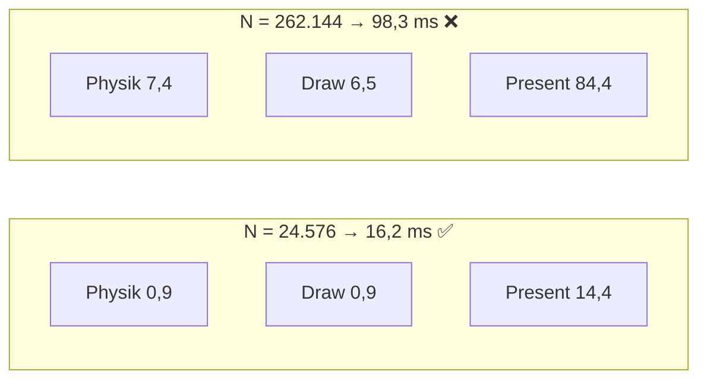

# Walkthrough: h konfigurierbar + 60-FPS-Maximum (03_hscale)

`h` ist per `--h` konfigurierbar (Default 0,04 unverändert). Die Vermessung
liefert zwei 60-FPS-Antworten: **Physik schafft den vollen Bereich bis
N = 262.144** (7,4 ms/Frame inkl. Download), **die GUI in dieser
Container+X11-Umgebung maximal ≈ 24.576 Partikel** — begrenzt vom
Present (indirektes GLX), nicht von Physik oder Draw-Schleife.

## 1. h-Sweep: Durchsatz & Stabilität (300 Schritte, dt = 0,0008)

| N | h | Zellen | ms/Schritt | MIUPS | Status |
|---|---|---|---|---|---|
| 16.384 | 0,02 | 80×50 | 0,108 | 151,9 | PASS |
| 16.384 | 0,03 | 54×34 | 0,163 | 100,4 | PASS |
| 16.384 | 0,04 | 40×25 | 0,287 | 57,1 | PASS |
| 16.384 | 0,06 | 27×17 | 0,575 | 28,5 | PASS |
| 32.768 | 0,02 | 80×50 | 0,179 | 182,7 | PASS |
| 32.768 | 0,028 | 58×36 | 0,275 | 119,0 | PASS |
| 32.768 | 0,04 | 40×25 | 0,616 | 53,2 | PASS |
| 65.536 | 0,015 | 107×67 | 0,314 | 208,9 | PASS |
| 65.536 | 0,02 | 80×50 | 0,447 | 146,5 | PASS |
| 65.536 | 0,03 | 54×34 | 0,928 | 70,6 | PASS |
| 65.536 | 0,04 | 40×25 | 1,920 | 34,1 | PASS |
| 98.304 | 0,016 | 100×63 | 0,561 | 175,2 | PASS |
| 98.304 | 0,02 | 80×50 | 0,790 | 124,4 | PASS |
| 131.072 | 0,014 | 115×72 | 0,793 | 165,2 | PASS |
| 131.072 | 0,02 | 80×50 | 1,219 | 107,5 | PASS |
| 262.144 | 0,01 | 160×100 | 1,485 | 176,5 | **FAIL** (545 Dichten, ρmax ≈ 16ρ₀) |
| 262.144 | 0,01, dt/2 | 160×100 | 1,598 | 164,1 | PASS |
| 262.144 | 0,015 | 107×67 | 2,297 | 114,1 | PASS |
| 262.144 | 0,02 | 80×50 | 3,690 | 71,0 | PASS |

Bestätigungen mit 500 Schritten: N=24.576/h=0,033 (0,258 ms, PASS),
N=262.144/h=0,015 (2,130 ms, PASS).

Lesart: Kosten ∝ Nachbarzahl ∝ (h/s)² — h = 0,02 statt 0,04 halbiert die
Schrittzeit mehr als (N=65k: 1,92 → 0,45 ms, 4,3×). MIUPS steigt mit N
(bessere SM-Auslastung, Spitze 209). Der einzige FAIL (262k, h=0,01)
zeigt die Stabilitätsgrenze: zu wenige Nachbarn + CFL-Verletzung →
Druckspitzen; mit halbiertem dt PASS (dann 6 Sub-Steps für gleiche
Sim-Zeit nötig — h=0,015 bleibt schneller).

## 2. Empfehlung: h(N) mit konstanter Nachbarzahl (~130)

Faustregel **h ≈ 0,04·√(16384/N)** (Verhältnis h/s ≈ 6,5 wie im
getunten Default), bei N=262k **0,015 statt 0,01** (s. Grenze oben):

| N | h | Physik/Frame (3 Sub-Steps + Download) |
|---|---|---|
| 16.384 | 0,04 (Default) | ~1,0 ms |
| 32.768 | 0,028 | ~1,0 ms |
| 65.536 | 0,02 | ~1,5 ms |
| 98.304 | 0,016 | ~2,0 ms |
| 131.072 | 0,014 | ~2,6 ms |
| 262.144 | 0,015 | ~7,4 ms |

Kleineres h ist schneller, aber physikalisch dünner (z. B. N=16k/h=0,02:
ρ̄ ≈ 541 statt 815 — große Nulldruck-Gebiete); die Tabelle hält das
Verhalten vergleichbar. **Kein `--auto-h` eingebaut:** Die 0,01/0,015-
Kante bei N=262k ist zu dünn vermessen für eine ausgelieferte Regel —
die Tabelle oben ist die Empfehlung. Der Default bleibt 0,04 (keine
Verhaltensänderung ohne Flag).

## 3. GUI: 60-FPS-Grenze bei ≈ 24.576 (Umgebung, nicht Physik)

Frame-Zerlegung (120 Frames, In-App-Timing nach Warmup):

| N | Frame Ø | FPS | Physik | Draw | Present | 60 FPS? |
|---|---|---|---|---|---|---|
| 16.384 | 11,56 ms | 86,5 | 0,92 | 0,54 | 10,10 | ✅ |
| 24.576 | 16,22 ms | 61,6 | 0,91 | 0,90 | 14,41 | ✅ |
| 26.624 | 17,00 ms | 58,8 | 0,94 | 0,77 | 15,29 | ❌ |
| 28.672 | 18,37 ms | 54,4 | 0,97 | 1,02 | 16,37 | ❌ |
| 32.768 | 20,60 ms | 48,6 | 0,93 | 1,20 | 18,47 | ❌ |
| 65.536 | 37,01 ms | 27,0 | 1,52 | 1,74 | 33,75 | ❌ |
| 262.144 | 98,25 ms | 10,2 | 7,39 | 6,47 | 84,39 | ❌ |

Der Flaschenhals ist **Present**: ~9 ms Sockel + ~0,5 µs/Partikel,
bei 262k 84 ms für ~38 MiB Vertex-Upload pro Frame über indirektes GLX
(Server: NVIDIA, Client: Mesa/indirekt). Physik (~1–7 ms) und Draw
(~0,5–6 ms) passen überall ins Budget. Auf einem lokalen Display mit
direktem Rendering würde Present kollabieren und das GUI-Maximum ans
Physik-Maximum (262k) heranrücken — als Prognose markiert, nicht gemessen.

## 4. Weitere Effizienz-Parameter

- **Blockgröße 128/256/512:** kein messbarer Unterschied (±0,2 %,
  Rauschen) bei N=16k/65k — die Kernel sind speichergebunden, Occupancy
  ist egal. **256 bleibt** (Experiment revertiert).
- **Draw-Schleife:** Letterbox-Skalierung (Divisionen!) und
  Farbmodus-Branch aus der Partikelschleife gehoist, Transform inline —
  Draw bei N=16k **1,06 → 0,54 ms (2×)**.
- **Nebenbefund (Bugfix):** `scale` war `(vw/dw).min(dh)` statt
  `.min(vh/dh)` — Partikel dadurch immer 2 px, Hindernis-/Wirbelkreise
  praktisch unsichtbar. Korrigiert (Partikel jetzt 4,8 px, Kreise
  sichtbar); Welt→Bild-Positionen unverändert exakt.
- **In-App-Timing:** Smoke-Test berichtet Ø ms/Frame, FPS sowie
  Physik/Draw/Present-Anteile (Warmup ausgenommen) — die Grundlage aller
  GUI-Zahlen oben.
- **Screenshot-Versuch:** X-Capture (`scrot`) liefert in diesem Setup nur
  schwarze Bilder (indirektes GL); die h-Empfehlung stützt sich daher auf
  Stabilitätsgate + Dichtestatistik, nicht auf Sichtprüfung.

## 5. Commits & Reproduktion

- `docs: plane h-Konfigurierbarkeit …`, `feat: mache Glättungslänge h …`,
  `perf: … Draw-Schleife …`, `docs: … Abschluss …`
- Sweep: `cargo oxide run --features gpu -- --headless --steps 300
  --particles N --h H --bench`; GUI: `--particles N --h H --frames 120`
  mit `DISPLAY=:0` (Smoke-Zeile beachten).
- Gates: `cargo fmt --check`, beide `cargo clippy -- -D warnings`,
  `cargo test` (26 Tests inkl. neuem `--h`-Parse-Test).
