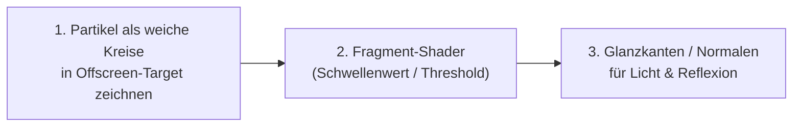

Um aus einer Ansammlung kleiner Punkte (Rechtecke) eine optisch ansprechende, zusammenhängende Flüssigkeit zu machen, gibt es in der Computergrafik bewährte Techniken. 

Für 2D-Fluide in `macroquad` reicht die Bandbreite von **schnellen Kniffen ohne Shader** bis zum **Goldstandard: Screen-Space-Metaballs**.

---

### 1. Der Goldstandard: Metaball / Screen-Space Fluid Rendering (Shader)

Das ist die Technik, die in professionellen 2D-Fluid-Demos (wie in Spielen wie *Noita* oder WebGL-Demos) verwendet wird. Sie verwandelt die Punkte in eine zusammenhängende, spiegelnde Wasseroberfläche.



#### Funktionsweise:
1. **Offscreen-Pass (Render-Target):**
   Partikel werden nicht direkt auf den Bildschirm gezeichnet, sondern in ein `macroquad::render_target`. Jedes Partikel wird als weicher, transparenter Kreis (radialer Verlauf von Alpha 1.0 im Zentrum bis 0.0 am Rand) gezeichnet. Wo viele Partikel dicht beieinander liegen, addiert sich der Alphawert zu $> 1.0$.
2. **Threshold-Pass (Fragment-Shader):**
   Ein einfacher Post-Processing-Shader liest diese Textur:
   * Ist `alpha < 0.5`: Hintergrund (kein Wasser, transparent/Luft).
   * Ist `alpha >= 0.5`: **Wasser!** Hier wird eine deckende Wasserfarbe gerendert.
   * **Der Clou (Oberflächenglanz):** Zwischen `0.5` und `0.55` zeichnet man eine hellblaue oder weiße Kante. Durch Ableitung des Alphas (`dFdx`/`dFdy` oder Pixel-Nachbarn) erhält man die Oberflächennormale für Glanzlichter (Specular Highlights).

#### Minimaler Fragment-Shader für `macroquad`:
```glsl
#version 100
precision mediump float;
varying vec2 uv;
uniform sampler2D Texture;

void main() {
    float a = texture2D(Texture, uv).a;
    
    if (a < 0.4) {
        // Luft / Hintergrund
        discard;
    } else if (a < 0.55) {
        // Schaum / Glanzkante an der Wasseroberfläche
        gl_FragColor = vec4(0.8, 0.95, 1.0, 1.0);
    } else {
        // Kern des Wassers (Tiefenblau mit Farbverlauf)
        vec4 deepWater = vec4(0.05, 0.25, 0.6, 0.9);
        vec4 shallowWater = vec4(0.0, 0.6, 0.85, 0.9);
        gl_FragColor = mix(shallowWater, deepWater, clamp((a - 0.55) * 1.5, 0.0, 1.0));
    }
}
```

---

### 2. Schnelle Upgrades (ohne Shader, direkt in Rust)

Wenn man keinen Custom-Shader schreiben möchte, lässt sich das Aussehen in `src/07_renderer.rs` mit wenigen Zeilen drastisch aufwerten:

#### A. Motion Blur & Partikel-Trails (Wasser-Schweife)
Statt den Bildschirm jeden Frame komplett hart mit `clear_background(...)` zu löschen, übermalt man ihn mit einem halbtransparenten Rechteck:
```rust
// Statt: clear_background(Color::from_rgba(8, 10, 18, 255));
// Zeichne ein halbtransparentes Vollbild-Rechteck:
draw_rectangle(0.0, 0.0, vw, vh, Color::from_rgba(8, 10, 18, 45));
```
* **Effekt:** Schnell fließende Partikel hinterlassen weiche Schweife ("Motion Blur"). Das Auge nimmt die Bewegung sofort als zusammenhängenden Fluss und nicht mehr als Stroboskop-Punkte wahr.

#### B. Weiche Sprites statt harter Rechtecke (`draw_texture` / Radial Alpha)
Ersetze `draw_rectangle` durch einen weichen Kreis. Ein Partikel sollte größer gezeichnet werden als sein physikalischer Radius, aber mit abfallender Deckkraft:
* Ein Partikel-Radius von $1{,}5 \times \text{Abstand}$ sorgt dafür, dass sich benachbarte Partikel optisch überlappen.
* Nutze `glam::Vec4` mit Alphawerten um `0.4`–`0.6`. Durch die Überlagerung verschmelzen dichte Regionen optisch zu einer kompakten Masse.

#### C. Bessere Farbpalette (Wasser-Ästhetik)
Das bisherige Farbschema (reines Rot/Blau/Grün) wirkt technisch wie eine Wärmebildkamera. Wasser wirkt natürlicher mit einer aquatischen Palette:

```rust
pub fn water_color(speed: f32, density_ratio: f32) -> Color {
    // Basis: Tiefes Ozeanblau
    let deep = Color::from_rgba(10, 45, 90, 220);
    // Mittel: Türkis / Cyan
    let mid = Color::from_rgba(0, 150, 210, 220);
    // Gischt / Sehr schnell: Fast Weiß
    let foam = Color::from_rgba(210, 240, 255, 255);

    let t = (speed / 5.0).clamp(0.0, 1.0);
    if t < 0.6 {
        mix(deep, mid, t / 0.6)
    } else {
        mix(mid, foam, (t - 0.6) / 0.4)
    }
}
```

---

### 3. Beleuchtung & Umgebungsdetails

Kleine Details im Renderer heben die Gesamtwirkung enorm:

1. **Glas-/Wasser-Reflexion am Hindernis:**
   * Gib dem Kreis-Hindernis einen leichten Schatten nach unten rechts (`draw_circle(ox + 4.0, oy + 4.0, obstacle_r * scale, Color::from_rgba(0, 0, 0, 80))`).
   * Zeichne einen weißen inneren Bogen oben links für einen Glanzlicht-Effekt.
2. **Boden & Wände gestalten:**
   * Statt nur eines dünnen grauen Drahtrahmens (`GRAY`), gib dem Becken einen massiven Rand (z. B. dunkles Metall oder Labor-Becken mit feinem Raster / Kacheln im Hintergrund).
3. **Schaum-Partikel (Gischt):**
   * Zeichne Partikel, deren Dichte sehr gering ist ($\rho < 0{,}7 \cdot \rho_0$) oder die eine hohe vertikale Geschwindigkeit nach oben haben, kleiner und reinweiß mit kurzem Trail. Sie wirken dann wie echte Spritzer und Luftbläschen.

### Empfohlene Reihenfolge für die Umsetzung:
1. **Sofort:** Trail-Effekt (teiltransparentes Löschen) + neue Wasserfarb-Palette (dauert 5 Minuten).
2. **Als Nächstes:** Partikel als weiche überlappende Kreise zeichnen.
3. **Für High-End-Optik:** `render_target` anlegen und den einfachen Metaball-Fragment-Shader vorschalten.
