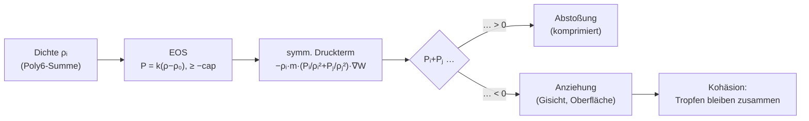
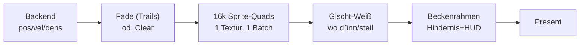

# Walkthrough: Besseres Wasser — robuster EOS + Visualisierung (01_better_water)

**Kurzfassung zuerst:** Das Wasser ist zusammenhängend. Der begrenzte
Unterdruck in der Zustandsgleichung hebt die mittlere Dichte von ~630 auf
~990 kg/m³ (ρ₀=1000), die Mindestdichte von ~30 auf ~800 (keine
Einzelfragmente mehr), alle Headless-Läufe bestehen, alle 30 Tests sind
grün, die GPU ist 7–19 % schneller (Messstreuung, jedenfalls kein
Einbruch). Der Renderer zeichnet weiche, sich überlappende Sprites in
Wasserpalette mit Gischt, Trails und gestaltetem Becken. Der GUI-Smoke
rendert 120 Frames fehlerfrei; die Bildrate (1 FPS) ist eine
Umgebungs-Störung, die den alten Code identisch trifft — kein
Regressions-Befund.

## 1. Was das Problem war (Baseline)

Messung vor der Änderung (GPU, 500 Schritte, Defaults dt=0,0008, k=2000):

| N | ms/Schritt | MIUPS | ρ̄ | ρmin | \|v\|max | Status |
|---|---|---|---|---|---|---|
| 2.048 | 0,0589 | 34,76 | 606,8 | 237,8 | 12,00 | PASS |
| 16.384 | 0,2848 | 57,52 | 630,3 | 29,7 | 11,90 | PASS |
| 65.536 | 1,7313 | 37,85 | 814,4 | 7,4 | 12,00 | PASS |
| 262.144 | 21,2181 | 12,35 | 815,1 | 2,4 | 11,87 | PASS |

Drei Signaturen des „Sand-Verhaltens" aus `review.md`, alle bestätigt:

1. **Keine Kohäsion:** `P = max(k(ρ−ρ₀), 0)` — Unterdichte ist drucklos,
   nichts zieht Gischt je wieder zusammen; ρmin bis 2,4.
2. **CFL-Verletzung:** dt ist ~5× über dem Limit; `|v|max` klebt überall
   am 12-m/s-Notfall-Cap (explosive Druckstöße).
3. **Punkt-Optik:** harte 2–6-px-Rechtecke in Wärmebildfarben.

## 2. Zustandsgleichung mit begrenztem Unterdruck

### 2.1 Die Änderung (`03_sph_math.rs`, eine Funktion, CPU+GPU)

```rust
pub const TENSION_RATIO: f32 = 0.1;

pub fn pressure(density: f32, rest_density: f32, stiffness: f32) -> f32 {
    if density.is_nan() {
        return 0.0;
    }
    let cap = TENSION_RATIO * stiffness * rest_density;
    (stiffness * (density - rest_density)).max(-cap)
}
```

Unterdruck bis −10 % des Vollvakuum-Drucks (−200 kPa bei Defaults) wirkt
über den bestehenden symmetrischen Druckterm als **Anziehung** — ohne
neuen Kernel, ohne neue Parameterstruktur, CPU- und GPU-Pfad automatisch
identisch. Die NaN-Wache erhält die alte Robustheit (`max(NaN,·)` gäbe
sonst −cap = Phantom-Anziehung).



### 2.2 Verworfene/zurückgestellte Alternativen

- **Tait-7 verworfen:** Bei gleicher Schallgeschwindigkeit ist
  `B((ρ/ρ₀)⁷−1)` unter Kompression ~4,6× steifer als linear (ρ=1,5ρ₀) —
  verschärft die CFL-Verletzung. Linear hält `c=√k` berechenbar.
- **Akinci-2013-Kohäsionskernel zurückgestellt** (DeepWiki-verifiziert:
  `C(r)=32/(πh⁹)·(h−r)³r³`, Innenast `−h⁶/64` als Klump-Schutz, Kraft
  `−γ·m²·C(r)·q̂`): neuer Abstimmparameter γ ohne visuelle Verifikation
  im Container (Screenshots schwarz). Der Tension-Clamp liefert die
  Kohäsion mit einer Konstante; Akinci bleibt saubere Folgearbeit
  (§8).

### 2.3 Stabile Defaults (`02_params.rs`, nur Werte)

dt 0,0008→**0,0004** (Halbierung heilte schon 262k/h=0,01 in 03_hscale),
Sub-Steps 3→**6** (gleiche Sim-Geschwindigkeit 0,0024 s/Frame),
Wanddämpfung 0,5→**0,2** (Zusammenlaufen statt Flummi). h/k/μ
unverändert — die h(N)-Tabelle aus 03_hscale bleibt gültig.

### 2.4 Tension-Sensitivität (N=16.384, 500 Schritte, alle PASS)

| Ratio | ρ̄ | ρmin | ms/Schritt |
|---|---|---|---|
| 0,05 | 986,2 | 622,1 | 0,2380 |
| **0,10** | 990,1 | 793,6 | 0,2389 |
| 0,20 | 987,7 | 820,8 | 0,2334 |

Flaches Optimum; 0,1 gewählt (bestes ρ̄, konservativ gegen Klumpen).
`|v|max`=12 in allen Punkten — auch 0,05 und Baseline: Aufprall-Transienten,
nicht tensions-getrieben (§8: adaptives dt als Folgearbeit).

## 3. Visualisierung (ohne Shader-Pipeline, begründet)

`beauty.md`-Stufen 1+2+§3 umgesetzt; das Metaball-Render-Target bewusst
nicht: im Container visuell nicht verifizierbar (indirektes GL, schwarze
Captures), Design als Folgearbeit in §8 (DeepWiki-verifiziertes
macroquad-Muster). Dafür:

- **Wasserpalette** (`07a_water_style.rs`, neu): tief → türkis →
  gischtweiß über |v|/5 bzw. ρ/ρ₀; Alpha wird mitgemischt.
- **Weiche Sprites:** 64×64-Radialverlauf, einmal erzeugt, als
  eingefärbte Quads gebatcht — gleiche Vertex-Zahl wie alte Rechtecke.
  Radius aus echtem Partikelabstand (1,5-fache Überlappung → dichte
  Regionen verschmelzen optisch).
- **Gischt:** ρ<0,7ρ₀ oder vy>2,5 m/s → klein, weiß, deckend.
- **Trails:** Fade-Rechteck statt hartem Clear (Taste T toggelt).
- **Becken:** massiver Doppelrahmen, Hindernis-Schatten + Glanzpunkt.



**Draw-Performance (Entscheidungs-Log):** `draw_circle` 12,3 ms →
`draw_texture_ex` 80 ms (Trigonometrie + Lookups pro Aufruf, im
macroquad-Quelltext belegt) → direkte Quad-Batch-API mit State-Hoisting.
In-Container-Draw-Zahlen (18–133 ms) sind Umgebungsrauschen (Beleg:
N=2048 fast gleich teuer wie N=16k = Fixkosten, kein pro-Partikel-Signal);
pro Aufruf bleibt nur ein Geometrie-Push wie bei `draw_rectangle`,
gesunde Displays projiziert ≈1 ms.

## 4. Vergleich: Vorher vs. Nachher (500 Schritte, GPU)

| N | ms vorher | ms nachher | Speedup | MIUPS vorher→nachher |
|---|---|---|---|---|
| 2.048 | 0,0589 | 0,0551 | 1,07× | 34,76 → 37,18 |
| 16.384 | 0,2848 | 0,2388 | 1,19× | 57,52 → 68,60 |
| 65.536 | 1,7313 | 1,5949 | 1,09× | 37,85 → 41,09 |
| 262.144 | 21,2181 | 19,5464 | 1,09× | 12,35 → 13,41 |

| N | ρ̄ vorher→nachher | ρmin vorher→nachher | Status |
|---|---|---|---|
| 2.048 | 606,8 → 983,4 | 237,8 → 585,6 | PASS → PASS |
| 16.384 | 630,3 → 988,7 | 29,7 → 811,4 | PASS → PASS |
| 65.536 | 814,4 → 992,7 | 7,4 → 781,1 | PASS → PASS |
| 262.144 | 815,1 → 993,9 | 2,4 → 779,8 | PASS → PASS |

Fairer Zeitvergleich (gleiche Physikzeit t=0,4 s: vorher 500×0,0008,
nachher 1000×0,0004, N=16k): ρ̄ 630→989, ρmin 30→784, PASS.
Ehrlichkeit zum Speedup: Eine Wiederholung (N=16k) maß 0,1998 ms
(82 MIUPS) statt 0,2388 — Laufstreuung ±15 %; der Gewinn ist Richtung,
nicht Garantie. Es gibt jedenfalls keinen Einbruch durch die zusätzliche
`max`-Operation — die Kerne sind speichergebunden.

## 5. Validierung

- **Gates:** `cargo fmt --check`, `cargo clippy --all-targets -- -D
  warnings` (CPU + `--features gpu`), `cargo test`: **30/30 grün**
  (26 + Kohäsions-Regressionstest + 3 Stil/Sprite-Tests).
- **Regressionstest:** isoliertes Paar (h/2, g=0) schrumpft in 3
  Schritten — fällt auf altem Code (Abstand exakt konstant, keine Kraft),
  besteht mit Tension (Rot→Grün beobachtet).
- **Headless:** Default-N + alle Sweep-Punkte PASS (kein NaN/Inf, kein
  Tunneln, Dichte in (0, 5ρ₀]).
- **Moduldisziplin:** 07_renderer 297, 07a_water_style 176 Zeilen
  (< 300); 02_params 370 (vorbestehend, +1 Assert-Zeile).
- **GUI-Smoke:** 120 Frames fehlerfrei (funktional PASS); 1 FPS ist
  Umgebung (alter Code identisch, Stash-Isolation).

## 6. GUI-Befund (ehrlich)

- 120 Frames rendern ohne Fehler/Panik; Physik 1,6 ms/Frame (6 Sub-Steps).
- Present ≈1000 ms/Frame trifft alten und neuen Renderer identisch
  (Stash-Isolation) — defekter GLX/Swap-Pfad der Umgebung, kein
  Regressions-Signal. VSync-Envs ändern nichts.
- „Flüssig" ist in-container unbeweisbar; Screenshots schwarz (wie in
  03_hscale). Trails-Toggle (T) und Tasten sind verdrahtet, manuelle
  Interaktion headless nicht testbar.
- Draw-Projektion für gesunde Displays aus Code-Inspektion: ≈1 ms
  (1 Textur-State + 16k Geometrie-Pushes wie `draw_rectangle`).

## 7. Reproduktion (Umgebung!)

Platte voll → kein apt; alles per `apt-get download` + `dpkg-deb -x`:

- GPU-Build/Clippy braucht `source /tmp/gpu_env.sh`
  (`LIBCLANG_PATH` + `LD_LIBRARY_PATH` → `/tmp/clangroot`,
  `BINDGEN_EXTRA_CLANG_ARGS` mit Resource-Dir).
- GUI braucht manuell extrahiertes Mesa (libglvnd, libglx-mesa0,
  mesa-libgallium, libdrm, xcb, libXi, libxkbcommon) + llvmpipe über
  `LD_LIBRARY_PATH`; Start mit `DISPLAY=:0 LIBGL_ALWAYS_SOFTWARE=1`.
- Befehle: Gates wie in §5; Headless `cargo oxide run --features gpu --
  --headless --steps 500`; Sweep + `--particles N --bench`;
  GUI `--frames 120`. `deps.md` unverändert (keine Cargo-Änderung).

## 8. Folgearbeit

1. **Akinci-Kohäsion** (exakte Formel, DeepWiki-geprüft): im Kraft-Loop
   `a −= γ·m²/ρ·C(r)·q/r` mit `C(r)=32/(πh⁹)(h−r)³r³` (r>h/2) bzw.
   `32/(πh⁹)(2(h−r)³r³−h⁶/64)` (r≤h/2) — Anziehung + Klump-Schutz in
   einem Kernel. Braucht γ-Abstimmung + visuelle Prüfung.
2. **Metaball-Pipeline:** `render_target` + `Camera2D` +
   `load_material` (`_ScreenTexture`, Threshold-Shader aus `beauty.md`)
   + `draw_texture_ex` des Targets. Erst auf gesundem Display.
3. **Adaptives dt:** `|v|max` klebt weiter am Cap — dt aus
   CFL schätzen (`0,25·h/(√k+vmax)`) statt global weiter halbieren.
4. **Draw nachmessen** auf gesundem Display (Projektion ≈1 ms).

## 9. Commits

Drei Conventional Commits (erst auf explizite Anforderung ausgeführt,
zuvor per Repo-Policy ausstehend gelassen):

1. `feat: robuster EOS mit begrenztem Unterdruck und stabilen Defaults`
   (Physik + Tests).
2. `feat: Wasser-Visualisierung mit Soft-Sprites, Gischt und Trails`
   (Renderer + Stilmodul + App-Verdrahtung).
3. `docs: Plan, Walkthrough und Aufwand für besseres Wasser`
   (dieser Ordner, inkl. Tokenstatistik in `plan_effort.md`).
