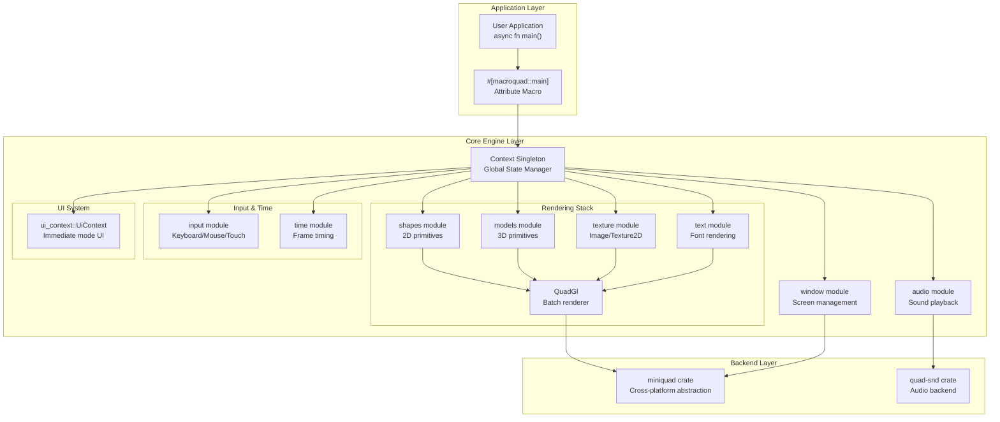
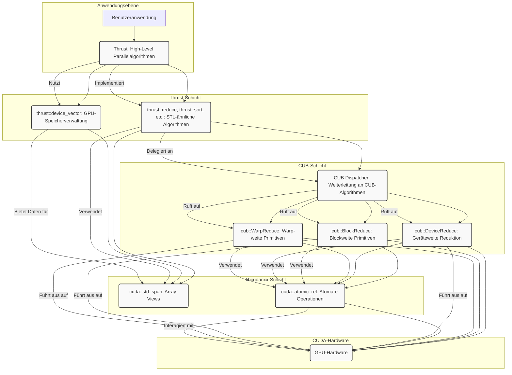
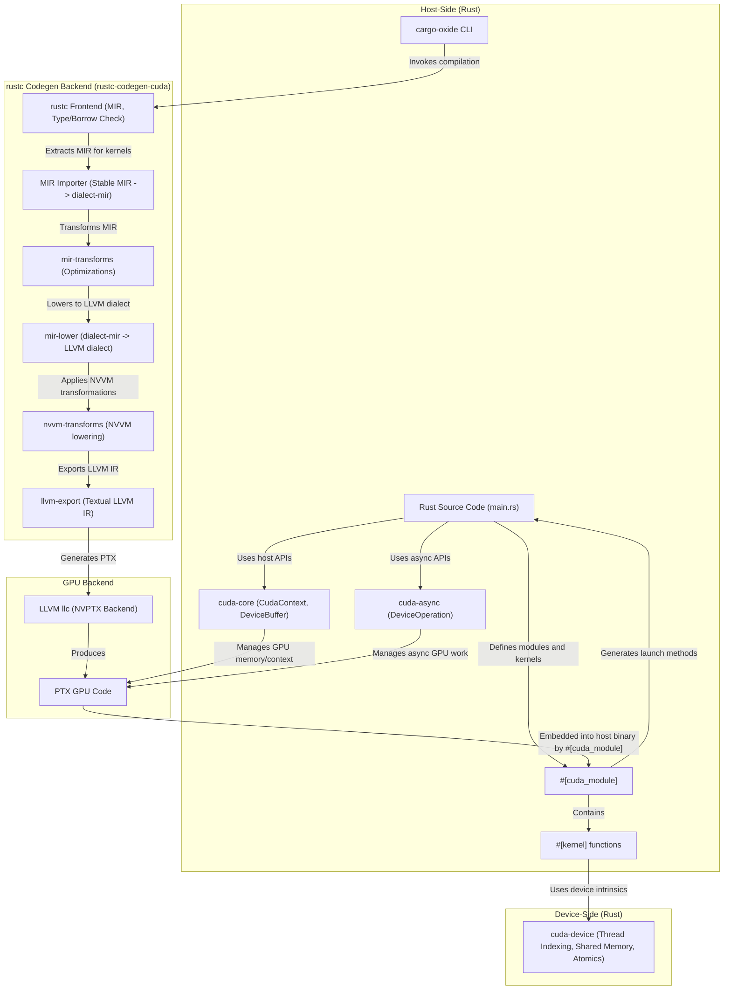

# not-fl3/macroquad

## GitHub & DeepWiki
- GitHub: https://github.com/not-fl3/macroquad
- DeepWiki: https://deepwiki.com/not-fl3/macroquad

## Kurze Einführung
`macroquad` ist eine einfache und benutzerfreundliche Spielbibliothek für Rust, die eine effiziente 2D-Rendering-Engine mit automatischer Geometrie-Batching bietet. Sie zielt darauf ab, plattformübergreifende Spieleentwicklung für PC, HTML5, Android und iOS zu vereinfachen, indem sie Rust-spezifische Konzepte wie Lifetimes und Borrowing minimiert. Die Bibliothek richtet sich an Entwickler, die schnell und unkompliziert Spiele oder grafische Anwendungen erstellen möchten, ohne sich um plattformspezifische Details kümmern zu müssen.    

## Die 3 wichtigsten (oder komplexesten) Algorithmen

### 1. Geometrie-Batching in `QuadGl`
1. **Name & Verortung im Code**: Der Geometrie-Batching-Algorithmus ist in der Struktur `QuadGl`  und ihren zugehörigen Methoden, insbesondere `geometry`  und `draw` , innerhalb der Datei `src/quad_gl.rs` implementiert. Die `DrawCall`-Struktur  repräsentiert eine einzelne Batch-Einheit.
2. **Detaillierte technische Funktionsweise**: `QuadGl` sammelt Zeichenbefehle (Geometrie, Texturen, Shader-Parameter) in einem `batch_vertex_buffer`  und `batch_index_buffer` . Wenn sich bestimmte Renderzustände ändern (z.B. Textur, Material, Clipping-Rechteck, Viewport, Modellmatrix, Pipeline oder Render-Pass), wird ein neuer `DrawCall` erstellt.  Am Ende des Frames oder wenn die Pufferkapazität erreicht ist, werden alle gesammelten `DrawCall`s in einem einzigen Aufruf an das `miniquad`-Backend gesendet.  Dies minimiert die Anzahl der GPU-Zustandswechsel und Draw-Calls.
3. **Warum prägend**: Dieser Algorithmus ist entscheidend für die Performance von `macroquad`, insbesondere bei 2D-Anwendungen. Durch das Batching wird die CPU-Last reduziert, da weniger Befehle an die GPU gesendet werden müssen. Dies führt zu einer effizienteren Nutzung der GPU und höheren Bildraten, was für ein flüssiges Spielerlebnis unerlässlich ist. 

### 2. `Context`-Singleton und Zustandsverwaltung
1. **Name & Verortung im Code**: Die zentrale Datenstruktur ist das `Context`-Singleton, definiert in `src/lib.rs` . Der Zugriff erfolgt über die Funktion `get_context()` .
2. **Detaillierte technische Funktionsweise**: Die `Context`-Struktur kapselt den gesamten globalen Zustand der Engine, einschließlich Rendering (`gl: QuadGl`), Audio (`audio_context: AudioContext`), Eingaben (`keys_down`, `mouse_position`), UI (`ui_context: UiContext`), Texturen (`textures: TexturesContext`) und Timing (`frame_time`, `start_time`).  Sie wird einmalig bei der Initialisierung erstellt  und ist über eine `static mut` Variable zugänglich.  Ein `thread_assert`  stellt sicher, dass der `Context` nur vom Haupt-Thread aus manipuliert wird, um Race Conditions zu vermeiden.
3. **Warum prägend**: Der `Context` ist das Herzstück von `macroquad` und ermöglicht eine einfache und konsistente API für alle Subsysteme. Er vereinfacht die Entwicklung, da Entwickler nicht explizit Referenzen zu verschiedenen Engine-Komponenten übergeben müssen. Die zentrale Zustandsverwaltung fördert die Kohärenz und erleichtert die Wartung der Codebasis.

### 3. Plattformübergreifende Abstraktion mit `miniquad`
1. **Name & Verortung im Code**: Die plattformübergreifende Abstraktion wird hauptsächlich durch die Integration des `miniquad`-Crates  realisiert. Im Code ist dies durch das Trait `miniquad::RenderingBackend`  und die Implementierung des `miniquad::EventHandler`  in der `Stage`-Struktur  in `src/lib.rs` zu finden.
2. **Detaillierte technische Funktionsweise**: `macroquad` delegiert alle plattformspezifischen Aufgaben wie Grafik-Rendering, Fensterverwaltung und Eingabeverarbeitung an `miniquad`.  Die `Context`-Struktur hält eine `Box<dyn miniquad::RenderingBackend>` , die die Schnittstelle zur zugrunde liegenden Grafik-API (z.B. OpenGL, WebGL, Metal) darstellt. Das `#[macroquad::main]`-Attribut-Makro  orchestriert den Anwendungslebenszyklus und nutzt `miniquad::start()` , um die plattformspezifische Event-Loop zu starten.
3. **Warum prägend**: Diese Abstraktionsschicht ist der Grundstein für die plattformübergreifende Kompatibilität von `macroquad`. Sie ermöglicht es Entwicklern, denselben Code für verschiedene Plattformen (Windows, Linux, macOS, HTML5, Android, iOS) zu verwenden, ohne sich um die Implementierungsdetails der jeweiligen Grafik-APIs kümmern zu müssen.  Dies reduziert den Entwicklungsaufwand erheblich und erweitert die Reichweite von `macroquad`-Anwendungen.

## Architektur & Zusammenspiel




## Notes
`macroquad` verwendet ein Single-Thread-Modell für den Zugriff auf den `Context`, das durch Laufzeitprüfungen (`thread_assert::same_thread()`)  anstelle von Compile-Zeit-Garantien abgesichert wird. Dies vereinfacht die API, erfordert jedoch, dass alle Engine-Operationen im Haupt-Thread ausgeführt werden. 

Das `experimental::scene` Modul  bietet eine Entitäts-Komponenten-System-ähnliche Struktur für die Verwaltung von Spielobjekten und deren Lebenszyklen, einschließlich `ready`, `update`, `fixed_update` und `draw` Methoden. 

Das `experimental::coroutines` Modul  ermöglicht die Emulation von Multitasking durch Coroutinen, was nützlich für die Organisation von Zustandsmaschinen und Animationen ist. 

Für das Asset-Management bietet `macroquad` Funktionen wie `load_file`  und `load_string` , die plattformübergreifend funktionieren und sogar HTTP-Anfragen für Web-Builds handhaben.  Es gibt auch eine Funktion `set_pc_assets_folder` , um Asset-Pfade zwischen PC und mobilen/Web-Plattformen konsistent zu halten. 

Wiki pages you might want to explore:
- [Architecture Overview (not-fl3/macroquad)](/wiki/not-fl3/macroquad#1.3)

View this search on DeepWiki: https://deepwiki.com/search/zielrepository-notfl3macroquad_41e666ad-d448-4f96-b454-530e71ec23f4

---

# InteractiveComputerGraphics/SPlisHSPlasH

## GitHub & DeepWiki
- GitHub: https://github.com/InteractiveComputerGraphics/SPlisHSPlasH
- DeepWiki: https://deepwiki.com/InteractiveComputerGraphics/SPlisHSPlasH

## Kurze Einführung
SPlisHSPlasH ist eine Open-Source-Bibliothek für die physikbasierte Simulation von Fluiden, die auf der Smoothed Particle Hydrodynamics (SPH)-Methode basiert . Sie implementiert verschiedene hochmoderne Drucklöser zur Simulation von Inkompressibilität sowie Methoden zur Simulation von Viskosität, Oberflächenspannung und Vortizität . Die Bibliothek richtet sich an Forscher und Entwickler im Bereich der Computergrafik und physikbasierten Simulation, die komplexe Fluideffekte effizient simulieren möchten .

## Die 3 wichtigsten (oder komplexesten) Algorithmen

### 1. DFSPH (Divergence-Free Smoothed Particle Hydrodynamics)
1.  **Name & Verortung im Code:** `TimeStepDFSPH`  im Modul `SPlisHSPlasH/DFSPH`. Die zugehörigen Datenstrukturen sind in `SimulationDataDFSPH` definiert .
2.  **Detaillierte technische Funktionsweise:** DFSPH ist ein zweistufiger Solver, der einen Divergenz-Solver zur Erzwingung eines divergenzfreien Geschwindigkeitsfeldes und einen Dichte-Solver zur Erzwingung einer konstanten Dichte verwendet . Der `step()`-Algorithmus beginnt mit der Nachbarschaftssuche und Dichteberechnung . Anschließend wird der `computeDFSPHFactor()` berechnet . Falls aktiviert, wird der `divergenceSolve()` aufgerufen, um das Geschwindigkeitsfeld divergenzfrei zu machen . Nach der Berechnung nicht-druckbasierter Kräfte und der Aktualisierung der Zeitschrittgröße , wird die Geschwindigkeit basierend auf diesen Kräften aktualisiert . Schließlich führt `pressureSolve()` iterative Korrekturen durch, um die Dichte konstant zu halten .
3.  **Warum prägend:** DFSPH bietet die stärkste Erzwingung der Inkompressibilität und ist besonders gut für hohe Viskosität geeignet, was es zur empfohlenen Methode für qualitativ hochwertige Simulationen macht . Dies geht jedoch mit den höchsten Rechenkosten einher .

### 2. PF (Projective Fluids)
1.  **Name & Verortung im Code:** `TimeStepPF`  im Modul `SPlisHSPlasH/PF`. Die zugehörigen Datenstrukturen sind in `SimulationDataPF`  definiert.
2.  **Detaillierte technische Funktionsweise:** PF basiert auf dem Framework der projektiven Dynamik und formuliert Inkompressibilität als ein eingeschränktes Optimierungsproblem, das mit einem matrixfreien konjugierten Gradientenlöser gelöst wird . Der `step()`-Algorithmus umfasst die Initialisierung von Positionen, Nachbarschaftssuche und die Lösung von PD-Constraints mittels eines matrixfreien CG-Solvers in `solvePDConstraints()` . Die Methode `matrixFreeRHS()` berechnet die rechte Seite des Gleichungssystems durch Constraint-Projektion .
3.  **Warum prägend:** PF zeichnet sich durch eine matrixfreie Formulierung aus, die speichereffizient ist, und verwendet einen konjugierten Gradientenlöser mit einem diagonalen Vorkonditionierer . Dies bietet eine gute Balance zwischen Genauigkeit und Leistung .

### 3. Neighborhood Search
1.  **Name & Verortung im Code:** Die Nachbarschaftssuche wird durch die abstrakte Schnittstelle `NeighborhoodSearch`  repräsentiert und in der `Simulation`-Klasse verwaltet . Die Implementierungen erfolgen über externe Bibliotheken wie [CompactNSearch](https://github.com/InteractiveComputerGraphics/CompactNSearch) (CPU) oder [cuNSearch](https://github.com/InteractiveComputerGraphics/cuNSearch) (GPU) .
2.  **Detaillierte technische Funktionsweise:** Die Nachbarschaftssuche ist entscheidend für SPH-Simulationen, da SPH-Kernel die Interaktionen zwischen Partikeln und ihren Nachbarn berechnen müssen . `FluidModel`-Instanzen registrieren ihre Partikel als Punktmengen beim `NeighborhoodSearch`-System . Die `Simulation`-Klasse aktualisiert die Punktmengen und führt die Nachbarschaftssuche in jedem Zeitschritt durch . Die Implementierungen nutzen räumliches Hashing, wobei CompactNSearch für CPU-Cache-Effizienz Partikel entlang einer Z-Kurve sortiert , während cuNSearch GPU-Parallelisierung und atomare Operationen verwendet .
3.  **Warum prägend:** Eine effiziente Nachbarschaftssuche ist grundlegend für die Performance von SPH-Simulationen, da sie die Komplexität der Interaktionsberechnungen maßgeblich beeinflusst . Die Möglichkeit, zwischen CPU- und GPU-Backends zu wählen, ermöglicht eine Skalierung der Simulationen für verschiedene Hardwarekonfigurationen und Partikelzahlen . Die Z-Sortierung verbessert die Cache-Kohärenz und reduziert die Speicherzugriffszeiten .

## Architektur & Zusammenspiel

```mermaid
graph TD
    subgraph "SPlisHSPlasH Core"
        Sim["Simulation (Singleton)"]
        TS["TimeStep (Abstract Base Class)"]
        FM["FluidModel"]
        BM["BoundaryModel"]
        AFS["AnimationFieldSystem"]
    end

    subgraph "Pressure Solvers (Derived from TimeStep)"
        WCSPH["TimeStepWCSPH"]
        PCISPH["TimeStepPCISPH"]
        PBF["TimeStepPBF"]
        IISPH["TimeStepIISPH"]
        DFSPH["TimeStepDFSPH"]
        PF["TimeStepPF"]
        ICSPH["TimeStepICSPH"]
    end

    subgraph "External Libraries"
        CompactNSearch["CompactNSearch (CPU)"]
        cuNSearch["cuNSearch (GPU)"]
        PositionBasedDynamics["PositionBasedDynamics"]
    end

    Sim -- "enthält 1" --> TS
    Sim -- "enthält N" --> FM
    Sim -- "enthält N" --> BM
    Sim -- "enthält 1" --> AFS

    TS <|-- WCSPH
    TS <|-- PCISPH
    TS <|-- PBF
    TS <|-- IISPH
    TS <|-- DFSPH
    TS <|-- PF
    TS <|-- ICSPH

    Sim -- "nutzt" --> CompactNSearch
    Sim -- "nutzt" --> cuNSearch
    BM -- "nutzt" --> PositionBasedDynamics

    FM -- "speichert Partikeldaten" --> Sim
    FM -- "wendet Nicht-Druck-Effekte an" --> Sim
    BM -- "repräsentiert statische/dynamische Körper" --> Sim

    DFSPH -- "berechnet Dichte & Divergenz" --> FM
    PF -- "löst Optimierungsproblem" --> FM
    CompactNSearch -- "liefert Nachbarn" --> DFSPH
    cuNSearch -- "liefert Nachbarn" --> DFSPH
    CompactNSearch -- "liefert Nachbarn" --> PF
    cuNSearch -- "liefert Nachbarn" --> PF
```
Die `Simulation`-Klasse ist der zentrale Bestandteil der Software und fungiert als Singleton . Sie orchestriert den Simulationsablauf und enthält eine Instanz von `TimeStep`, die den Drucklöser und den Simulationsalgorithmus definiert . Des Weiteren verwaltet die `Simulation`-Klasse mehrere `FluidModel`-Instanzen für verschiedene Fluidphasen und `BoundaryModel`-Instanzen für statische oder dynamische Grenzen .

Die `TimeStep`-Klasse ist eine abstrakte Basisklasse, von der alle spezifischen Drucklöser wie `TimeStepDFSPH` und `TimeStepPF` abgeleitet sind . Jeder dieser Solver implementiert die `step()`-Funktion, die den eigentlichen Simulationsalgorithmus enthält .

Die `FluidModel`-Klasse speichert physikalische und simulationsbezogene Partikeldaten wie Masse, Position, Geschwindigkeit und Dichte . Sie enthält auch Referenzen zu nicht-druckbasierten Effekten wie Viskosität und Oberflächenspannung .

Die Nachbarschaftssuche, die entweder von `CompactNSearch` (CPU) oder `cuNSearch` (GPU) bereitgestellt wird, ist eng in die `Simulation`-Klasse integriert und wird von den `TimeStep`-Implementierungen zur effizienten Abfrage von Nachbarpartikeln genutzt .

## Notes
**AVX-Vektorisierung:** Die Bibliothek nutzt AVX-Instruktionen zur Leistungsoptimierung bei Dichteberechnungen und Druckkraftberechnungen, wenn `USE_AVX` definiert ist . Dies ermöglicht eine parallele Verarbeitung von Daten und führt zu einer erheblichen Beschleunigung auf unterstützter Hardware .

**Warmstart:** Solver wie DFSPH und PF unterstützen einen Warmstart, indem sie Druckwerte aus dem vorherigen Zeitschritt wiederverwenden . Dies reduziert die Anzahl der erforderlichen Iterationen und verbessert die Konvergenzgeschwindigkeit .

**Partikelsortierung:** Die Nachbarschaftssuche kann Partikel sortieren, um die Cache-Kohärenz zu verbessern . Die Methode `performNeighborhoodSearchSort()` in `FluidModel` ordnet alle Partikeldatenfelder neu an, basierend auf der räumlichen Anordnung, die von der Nachbarschaftssuche bereitgestellt wird . Dies führt zu besseren CPU-Cache-Trefferquoten und reduziert die Speicherzugriffslatenz .

Wiki pages you might want to explore:
- [SPH Pressure Solvers (InteractiveComputerGraphics/SPlisHSPlasH)](/wiki/InteractiveComputerGraphics/SPlisHSPlasH#3.3)
- [Neighborhood Search (InteractiveComputerGraphics/SPlisHSPlasH)](/wiki/InteractiveComputerGraphics/SPlisHSPlasH#3.6)

View this search on DeepWiki: https://deepwiki.com/search/zielrepository-interactivecomp_d7917f42-710b-4196-8bce-593c5f016298

---

# NVIDIA/cccl

## GitHub & DeepWiki
- GitHub: https://github.com/NVIDIA/cccl
- DeepWiki: https://deepwiki.com/NVIDIA/cccl

## Kurze Einführung
Das NVIDIA/cccl-Repository vereint drei wesentliche CUDA C++ Bibliotheken: Thrust, CUB und libcudacxx, um CUDA C++ Entwicklern Bausteine für sicheren und effizienten Code bereitzustellen . Es zielt darauf ab, die Entwicklung zu optimieren und die Nutzung der CUDA C++ Leistung zu erweitern, indem es eine umfassende Sammlung von Hochleistungs-Tools für die GPU-Programmierung bietet . Die Zielgruppe sind CUDA C++ Entwickler, die von hochabstrahierten Algorithmen bis hin zu hardwarenahen Primitiven effiziente Lösungen suchen .

## Die 3 wichtigsten (oder komplexesten) Algorithmen

### 1. `cub::BlockReduce`
1.  **Name & Verortung im Code**: `cub::BlockReduce` ist eine zentrale Komponente in CUB und befindet sich hauptsächlich in `cub/cub/block/block_reduce.cuh` . Es wird auch in Beispielen wie in `README.md` verwendet .
2.  **Detaillierte technische Funktionsweise**: `cub::BlockReduce` bietet kollektive Methoden zur Berechnung einer parallelen Reduktion von Elementen, die über einen CUDA-Thread-Block verteilt sind . Es unterstützt verschiedene Algorithmen wie `BLOCK_REDUCE_RAKING_COMMUTATIVE_ONLY` für kommutative Operationen und `BLOCK_REDUCE_RAKING` für nicht-kommutative Operationen . Diese Algorithmen umfassen typischerweise Phasen wie die sequentielle Reduktion in Registern, die Reduktion im Shared Memory und eine Warp-synchrone Reduktion .
3.  **"Warum prägend"**: `cub::BlockReduce` ist prägend, da es CUDA-Kernel-Entwicklern einen grundlegenden Baustein für die Erstellung hochoptimierter, benutzerdefinierter Kernel bietet . Es ermöglicht eine effiziente Aggregation von Daten innerhalb eines Thread-Blocks, was entscheidend für die Performance vieler paralleler Algorithmen ist. Die verschiedenen Algorithmusvarianten erlauben eine Anpassung an spezifische Reduktionsoperationen und Performance-Anforderungen .

### 2. `thrust::reduce`
1.  **Name & Verortung im Code**: `thrust::reduce` ist ein Algorithmus aus der Thrust-Bibliothek und wird in der Regel über `thrust/reduce.h` eingebunden. Ein Beispiel für die Verwendung findet sich in `README.md` .
2.  **Detaillierte technische Funktionsweise**: `thrust::reduce` ist ein paralleler Algorithmus, der eine Reduktionsoperation (z.B. Summe, Minimum, Maximum) über einen Bereich von Elementen ausführt . Es bietet eine STL-ähnliche Schnittstelle und kann sowohl auf Host- als auch auf Device-Daten angewendet werden, wobei die Ausführung durch Ausführungsrichtlinien wie `thrust::device` gesteuert wird . Intern delegiert `thrust::reduce` die eigentliche GPU-Ausführung an optimierte CUB-Algorithmen wie `cub::DeviceReduce` .
3.  **"Warum prägend"**: `thrust::reduce` ist prägend, weil es die Produktivität von Programmierern erheblich steigert, indem es eine hochabstrahierte, einfach zu bedienende Schnittstelle für parallele Reduktionen bietet . Es ermöglicht Performance-Portabilität zwischen GPUs und Multi-Core-CPUs und verbirgt die Komplexität der GPU-Programmierung, während es gleichzeitig von der hohen Leistung der CUB-Backends profitiert .

### 3. `cuda::atomic_ref`
1.  **Name & Verortung im Code**: `cuda::atomic_ref` ist Teil von libcudacxx und wird über `<cuda/atomic>` eingebunden . Ein Anwendungsbeispiel findet sich in `README.md` .
2.  **Detaillierte technische Funktionsweise**: `cuda::atomic_ref` bietet eine Möglichkeit, atomare Operationen auf bestehenden Speicherorten durchzuführen . Es ist eine nicht-besitzende Referenz auf ein Objekt, das atomar manipuliert werden kann. Dies ist entscheidend für die korrekte Synchronisation und Datenkonsistenz in parallelen Umgebungen, insbesondere wenn mehrere Threads gleichzeitig auf dieselben Speicheradressen zugreifen . Es unterstützt verschiedene Speicherordnungsmodelle, wie `cuda::memory_order_relaxed` .
3.  **"Warum prägend"**: `cuda::atomic_ref` ist prägend, da es eine grundlegende Abstraktion für CUDA-spezifische Hardware-Features wie Synchronisationsprimitive und Atomics bereitstellt . Es ermöglicht die Implementierung von sicheren und korrekten parallelen Algorithmen, bei denen globale Aggregationen oder gemeinsame Datenstrukturen ohne Race Conditions aktualisiert werden müssen. Dies ist unerlässlich für die Skalierbarkeit und Korrektheit von GPU-Anwendungen.

## Architektur & Zusammenspiel

Das NVIDIA/cccl-Repository vereint Thrust, CUB und libcudacxx, die auf unterschiedlichen Abstraktionsebenen arbeiten und nahtlos zusammenwirken .


**Erläuterung des Zusammenspiels:**
*   **Thrust** bildet die oberste Abstraktionsebene und bietet eine STL-ähnliche Schnittstelle für parallele Algorithmen wie `thrust::reduce` oder `thrust::sort` . Es verwaltet GPU-Speicher transparent über `thrust::device_vector` .
*   **CUB** ist eine CUDA-spezifische Bibliothek für niedrigere Ebenen, die "speed-of-light" parallele Algorithmen über alle GPU-Architekturen hinweg bereitstellt . Thrust-Algorithmen delegieren ihre Ausführung an CUB-Primitiven wie `cub::DeviceReduce` für geräteweite Operationen oder `cub::BlockReduce` für blockweite Operationen . CUB bietet auch kooperative Algorithmen wie `cub::WarpReduce` für die Entwicklung benutzerdefinierter Kernel .
*   **libcudacxx** ist die CUDA C++ Standardbibliothek, die eine Implementierung der C++ Standardbibliothek für Host- und Device-Code bereitstellt . Sie bietet auch Abstraktionen für CUDA-spezifische Hardware-Features wie Synchronisationsprimitive (`cuda::atomic_ref`), Cache-Kontrolle und Atomics . Komponenten wie `cuda::std::span` werden verwendet, um effiziente Views auf Daten in Kerneln zu übergeben .

Dieses Zusammenspiel ermöglicht es Entwicklern, von hochproduktiven, abstrakten Algorithmen bis hin zu fein abgestimmten, hardwarenahen Kerneln zu arbeiten, wobei alle Schichten optimal aufeinander abgestimmt sind, um maximale Leistung auf NVIDIA GPUs zu erzielen .

## Notes
Eine weitere wichtige technische Komponente ist das **Execution Policy System** von Thrust, das eine feingranulare Kontrolle über die Algorithmusausführung ermöglicht und gleichzeitig die Portabilität bewahrt . Richtlinien wie `thrust::device`, `thrust::host`, `thrust::par` und `thrust::seq` steuern, ob ein Algorithmus auf der GPU, einer sequentiellen CPU oder einer parallelen CPU ausgeführt wird . Dies ermöglicht eine flexible Anpassung an verschiedene Hardware-Umgebungen und Leistungsanforderungen.

Wiki pages you might want to explore:
- [Quick Start Examples (NVIDIA/cccl)](/wiki/NVIDIA/cccl#1.3)
- [Thrust (NVIDIA/cccl)](/wiki/NVIDIA/cccl#2.1)

View this search on DeepWiki: https://deepwiki.com/search/zielrepository-nvidiacccl-erst_af129dd5-0bd3-449b-851e-21fec01f66bf

---

# NVIDIA/cuda-samples

## GitHub & DeepWiki
- GitHub: https://github.com/NVIDIA/cuda-samples
- DeepWiki: https://deepwiki.com/NVIDIA/cuda-samples

## Kurze Einführung
Das `NVIDIA/cuda-samples`-Repository ist eine Sammlung von Beispielprogrammen und Dienstprogrammen, die CUDA-Programmierkonzepte, -techniken und -funktionen demonstrieren. Es dient als Referenzimplementierung und Lernressource für Entwickler, die mit dem NVIDIA CUDA Toolkit ab Version 13.3 arbeiten.  Die Beispiele decken ein breites Spektrum ab, von grundlegenden Operationen bis hin zu fortgeschrittenen CUDA-Funktionen und der Integration von CUDA-Bibliotheken. 

## Die 3 wichtigsten (oder komplexesten) Algorithmen

### 1. Matrix-Multiplikation mit Tensor Cores (GEMM)
**Verortung im Code:**
Die Implementierungen finden sich in verschiedenen Dateien, die sich auf unterschiedliche Datentypen und CUDA-Versionen konzentrieren:
- `cpp/3_CUDA_Features/cudaTensorCoreGemm/cudaTensorCoreGemm.cu`  (für allgemeine GEMM mit WMMA API, eingeführt in CUDA 9)
- `cpp/3_CUDA_Features/dmmaTensorCoreGemm/dmmaTensorCoreGemm.cu`  (für Double-Precision GEMM mit WMMA API, eingeführt in CUDA 11)
- `cpp/3_CUDA_Features/immaTensorCoreGemm/immaTensorCoreGemm.cu`  (für Integer GEMM mit WMMA API, eingeführt in CUDA 10)
- `cpp/3_CUDA_Features/bf16TensorCoreGemm/bf16TensorCoreGemm.cu`  (für BFloat16 GEMM mit WMMA API, eingeführt in CUDA 11)
- `cpp/3_CUDA_Features/tf32TensorCoreGemm/tf32TensorCoreGemm.cu`  (für TF32 GEMM mit WMMA API, eingeführt in CUDA 11)

**Detaillierte technische Funktionsweise:**
Diese Beispiele demonstrieren die Berechnung einer Matrixmultiplikation und -addition der Form `D = alpha * A * B + beta * C` unter Verwendung der Warp Matrix Multiply and Accumulate (WMMA) API.  Jede CTA (Cooperative Thread Array) berechnet eine Kachel der resultierenden Matrix pro Iteration.  Warps innerhalb der CTA berechnen kleinere Unterkacheln mithilfe von `nvcuda::wmma::mma_sync`-Operationen, indem sie die K-Dimension der Matrizen A und B durchlaufen und das Zwischenergebnis akkumulieren.  Optimierungen umfassen das Kopieren von Matrixkacheln in den Shared Memory, um globale Speicherzugriffe zu reduzieren, und das Hinzufügen von Padding (Skew) im Shared Memory, um Bankkonflikte zu vermeiden.  Einige Beispiele nutzen auch asynchrone Kopieroperationen (`cuda::pipeline` und `cooperative_groups::memcpy_async`) für den Transfer von Global Memory zu Shared Memory, um die Kernel-Performance zu verbessern. 

**Warum prägend:**
Diese Algorithmen sind prägend, da sie die Nutzung der Tensor Cores in NVIDIA GPUs demonstrieren, die speziell für hochperformante Matrixoperationen in Anwendungen wie Deep Learning entwickelt wurden.  Die WMMA API ermöglicht es Entwicklern, diese spezialisierte Hardware effizient zu nutzen, was zu erheblichen Leistungssteigerungen gegenüber traditionellen CUDA-Kerneln führt.  Die gezeigten Optimierungen, wie Shared Memory Caching und asynchrone Kopien, sind entscheidend für das Erreichen maximaler Durchsatzraten und die Reduzierung von Speicherlatenzen, was die Skalierbarkeit und Effizienz der Berechnungen auf modernen GPUs maßgeblich beeinflusst. 

### 2. Konjugierte Gradienten (CG) Solver
**Verortung im Code:**
- `cpp/4_CUDA_Libraries/conjugateGradientMultiBlockCG/conjugateGradientMultiBlockCG.cu`  (für Multi-Block Cooperative Groups)
- `cpp/4_CUDA_Libraries/conjugateGradientMultiDeviceCG/conjugateGradientMultiDeviceCG.cu`  (für Multi-GPU mit Unified Memory)

**Detaillierte technische Funktionsweise:**
Der Konjugierte Gradienten (CG) Algorithmus wird zur Lösung großer linearer Gleichungssysteme `Ax = b` verwendet, insbesondere wenn A eine symmetrische und positiv definite Matrix ist.  Die Implementierungen in den Beispielen nutzen CUDA Cooperative Groups, um die Parallelisierung über mehrere Thread-Blöcke oder sogar mehrere GPUs zu koordinieren.  Der Algorithmus beinhaltet typischerweise Operationen wie Sparse Matrix-Vektor-Multiplikation (`gpuSpMV`), Vektor-Skalierung und Addition (`gpuScaleVectorAndSaxpy`) sowie Dot-Produkte (`gpuDotProduct`).  Die Multi-GPU-Version (`conjugateGradientMultiDeviceCG`) verwendet Unified Memory mit optimiertem Prefetching und Usage Hints, um Daten effizient zwischen Host und mehreren Geräten zu verwalten und zu migrieren. 

**Warum prägend:**
Der CG-Algorithmus ist ein Eckpfeiler in vielen wissenschaftlichen und technischen Simulationen. Seine Implementierung in CUDA-Samples zeigt, wie komplexe iterative Algorithmen effizient auf GPUs parallelisiert werden können.  Die Verwendung von Cooperative Groups und Unified Memory in den Multi-GPU-Beispielen ist entscheidend für die Skalierung der Leistung über einzelne GPUs hinaus, was für sehr große Problemstellungen unerlässlich ist.  Dies demonstriert fortgeschrittene Techniken zur Verwaltung von Datenkohärenz und zur Minimierung von Kommunikations-Overhead in heterogenen Systemen.

### 3. Asynchrone Kopien und Arrive-Wait Barrieren in Matrix-Multiplikation
**Verortung im Code:**
- `cpp/3_CUDA_Features/globalToShmemAsyncCopy/globalToShmemAsyncCopy.cu` 

**Detaillierte technische Funktionsweise:**
Dieses Beispiel implementiert eine Matrixmultiplikation, die Shared Memory für die Datenwiederverwendung nutzt und einen Tiling-Ansatz verfolgt.  Für GPUs mit Compute Capability 8.0 oder höher verwendet der CUDA-Kernel asynchrone Kopieroperationen, um Daten vom Global Memory in den Shared Memory zu übertragen (`async-copy`).  Dies ermöglicht es, Datenübertragungen mit Berechnungen zu überlappen. Zur Synchronisation wird eine Arrive-Wait Barriere (`cuda::barrier`) verwendet, um sicherzustellen, dass alle Threads in einer Gruppe die Daten im Shared Memory haben, bevor die Berechnungen beginnen.  Das Beispiel vergleicht verschiedene Kernel-Implementierungen, darunter naive Ansätze und solche mit asynchronen Kopien in verschiedenen Stufen. 

**Warum prägend:**
Dieser Algorithmus ist prägend, da er moderne CUDA-Optimierungstechniken demonstriert, die darauf abzielen, die Latenz von Speicherzugriffen zu verbergen und die GPU-Auslastung zu maximieren.  Asynchrone Kopien und Arrive-Wait Barrieren sind entscheidend für das Erreichen hoher Performance auf neueren GPU-Architekturen, indem sie die Überlappung von Speicheroperationen und Kernel-Ausführung ermöglichen.  Dies ist besonders wichtig für speicherintensive Algorithmen wie die Matrixmultiplikation, bei denen die Datenbewegung oft einen Engpass darstellt.

## Architektur & Zusammenspiel

```mermaid
graph TD
    A[CUDA Samples Repository] --> B(cpp/ - C++ Samples)
    A --> C(python/ - Python Samples)
    A --> D(Infrastructure)

    B --> B0[0_Introduction]
    B --> B1[1_Utilities]
    B --> B2[2_Concepts_and_Techniques]
    B --> B3[3_CUDA_Features]
    B --> B4[4_CUDA_Libraries]
    B --> B5[5_Domain_Specific]
    B --> B6[6_Performance]
    B --> B7[7_libNVVM]
    B --> B8[8_Platform_Specific]
    B --> B9[9_CUDA_Tile]

    D --> D1(cpp/Common/ - Common Utilities)
    D --> D2(cmake/ - Build System)
    D --> D3(run_tests.py - Testing Framework)

    B3 --> B3_1[Tensor Core GEMM Samples]
    B3 --> B3_2[globalToShmemAsyncCopy]
    B4 --> B4_1[Conjugate Gradient Samples]

    B3_1 --> WMMA[Warp Matrix Multiply and Accumulate (WMMA) API]
    B3_1 --> TC[Tensor Cores]
    B3_1 --> AsyncCopy[Asynchrone Kopien (gmem to shmem)]

    B3_2 --> AsyncCopy
    B3_2 --> AWBarrier[Arrive-Wait Barrier]

    B4_1 --> CG[Conjugate Gradient Algorithm]
    B4_1 --> CG_MultiBlock[Multi-Block Cooperative Groups]
    B4_1 --> CG_MultiDevice[Multi-GPU / Unified Memory]

    WMMA --> TC
    AsyncCopy --> AWBarrier

    CG_MultiBlock --> CG
    CG_MultiDevice --> CG

    style B3_1 fill:#f9f,stroke:#333,stroke-width:2px
    style B3_2 fill:#f9f,stroke:#333,stroke-width:2px
    style B4_1 fill:#f9f,stroke:#333,stroke-width:2px
```
     

## Notes
Weitere technische Highlights umfassen die breite Palette an CUDA-Bibliotheken, die in Kategorie 4 (`cpp/4_CUDA_Libraries`) demonstriert werden, wie cuBLAS, cuFFT, NPP, cuSPARSE und cuSOLVER, die GPU-beschleunigte Funktionen für verschiedene Domänen bieten.  Das Repository zeigt auch fortgeschrittene Konzepte wie CUDA Dynamic Parallelism (CDP) in Kategorie 3 (`cpp/3_CUDA_Features`), das die dynamische Kernel-Startfähigkeit von der GPU selbst ermöglicht.  Für die Speicherverwaltung werden Techniken wie Unified Virtual Memory (UVM) und Stream-Ordered Memory Allocation (`cudaMallocAsync`) hervorgehoben, die die Datenbewegung zwischen Host und Gerät vereinfachen und optimieren. <cite repo="NVIDIA/

Wiki pages you might want to explore:
- [Overview (NVIDIA/cuda-samples)](/wiki/NVIDIA/cuda-samples#1)
- [Introduction Samples (Category 0) (NVIDIA/cuda-samples)](/wiki/NVIDIA/cuda-samples#4)

View this search on DeepWiki: https://deepwiki.com/search/zielrepository-nvidiacudasampl_93918182-b724-4e26-a0f8-100fca391297

---

# NVIDIA/cuda-rust

## GitHub & DeepWiki
- GitHub: https://github.com/NVIDIA/cuda-rust
- DeepWiki: https://deepwiki.com/NVIDIA/cuda-rust

## Kurze Einführung
Das NVIDIA/cuda-rust Repository bietet ein umfassendes Ökosystem für die GPU-Programmierung in Rust, das sich auf NVIDIA CUDA-Plattformen konzentriert. Es ermöglicht das Schreiben von CUDA-Kerneln direkt in Rust durch einen benutzerdefinierten `rustc`-Codegen-Backend, der Rust-Code in PTX (Parallel Thread Execution) übersetzt . Ziel ist es, eine typsichere, speichersichere und ergonomische Entwicklung von GPU-Anwendungen in Rust zu ermöglichen .

## Die 3 wichtigsten (oder komplexesten) Algorithmen

### 1. `rustc-codegen-cuda` Backend: MIR zu PTX Kompilierung
1.  **Name & Verortung im Code**: Der Kern dieses Algorithmus ist der `rustc-codegen-cuda` Crate , der als benutzerdefiniertes `rustc`-Backend fungiert . Die Logik ist hauptsächlich in `cuda-oxide/crates/rustc-codegen-cuda/src/lib.rs`, `collector.rs` und `device_codegen.rs` implementiert .

2.  **Detaillierte technische Funktionsweise**: Dieses Backend fängt den normalen Rust-Kompilierungsprozess ab . Es identifiziert Funktionen, die mit `#[kernel]` annotiert sind, indem es nach einem reservierten Namensraum sucht . Der Rust MIR (Mid-level IR) dieser Kernel-Funktionen wird dann in eine Reihe von Zwischenrepräsentationen (IRs) übersetzt: zuerst in `dialect-mir` (ein MLIR-ähnliches IR-Framework namens Pliron) , dann durch Optimierungspässe wie Schleifenentrollung und SSA-Promotion (`mem2reg`) , und schließlich in das LLVM-Dialekt . Textuelles LLVM IR wird erzeugt und an das NVPTX-Backend von LLVM (`llc`) übergeben, um das endgültige PTX zu generieren .

3.  **"Warum prägend"**: Dieser Kompilierungs-Pipeline ist prägend, da er die nahtlose Integration von Host- und Device-Code in einer einzigen Rust-Quelldatei ermöglicht . Durch die Nutzung des `rustc`-Frontends erbt `cuda-oxide` die Typsicherheit, das Borrow-Checking und die Monomorphisierung von Rust, was die Entwicklung von GPU-Kerneln erheblich vereinfacht und die Fehleranfälligkeit reduziert . Die modulare IR-Architektur mit Pliron bietet zudem Flexibilität und Erweiterbarkeit für GPU-spezifische Transformationen .

### 2. `DisjointSlice<T, IndexSpace>` für speichersichere parallele Schreibvorgänge
1.  **Name & Verortung im Code**: `DisjointSlice<T, IndexSpace>` ist eine zentrale Datenstruktur, die im `cuda-device` Crate definiert ist . Sie wird in Verbindung mit `ThreadIndex<'kernel, IndexSpace>` verwendet .

2.  **Detaillierte technische Funktionsweise**: `DisjointSlice<T, IndexSpace>` ist ein Slice-ähnlicher Typ, der sichere parallele Schreibvorgänge auf der GPU ermöglicht . Die Methode `get_mut()` akzeptiert nur einen `ThreadIndex`, dessen `IndexSpace` mit dem eigenen übereinstimmt . `ThreadIndex` ist ein undurchsichtiges Witness, das nur über vertrauenswürdige Funktionen wie `thread::index_1d()` oder `thread::index_2d::<S>()` erstellt werden kann . Dies stellt sicher, dass jeder Thread nur auf seinen zugewiesenen Speicherbereich zugreifen kann, wodurch Datenkonflikte vermieden werden .

3.  **"Warum prägend"**: Diese Datenstruktur ist entscheidend für die Sicherheit in der GPU-Programmierung mit Rust . Sie erweitert die Ownership- und Borrowing-Regeln von Rust auf den Device-Code und ermöglicht es, speichersichere Kernel zu schreiben, die von Natur aus datenkonfliktfrei sind . Dies ist besonders wichtig in einer Umgebung mit Tausenden von gleichzeitig laufenden Threads, wo traditionelle Borrow-Checker-Regeln nicht direkt anwendbar sind .

### 3. `#[cuda_module]` und Kernel-Launch-Mechanismus
1.  **Name & Verortung im Code**: Das `#[cuda_module]` Attribut ist ein Prozedurales Makro, das im `cuda-macros` Crate implementiert ist . Es wird verwendet, um Kernel-Module zu definieren und den Host-seitigen Launch-Code zu generieren .

2.  **Detaillierte technische Funktionsweise**: Wenn ein Modul mit `#[cuda_module]` annotiert wird, bettet es den kompilierten Device-Code (PTX) in das Host-Binary ein . Gleichzeitig generiert es eine typisierte Host-API, die das Laden des Moduls und das Starten der darin enthaltenen `#[kernel]`-Funktionen ermöglicht . Kernel-Argumente werden dabei typgeprüft . Für sichere Launches kann ein `#[launch_contract]` verwendet werden, der eine `PreparedLaunch` ermöglicht, die die Launch-Anforderungen des Kernels überprüft .

3.  **"Warum prägend"**: Dieser Mechanismus ist entscheidend für die Ergonomie und Sicherheit der Kernel-Starts . Er abstrahiert die Komplexität des Ladens von Device-Code, des Konfigurierens des Grids und des Marshallings von Argumenten, indem er eine typsichere und oft sichere API bereitstellt . Dies reduziert die Wahrscheinlichkeit von Laufzeitfehlern und macht die GPU-Programmierung in Rust zugänglicher .

## Architektur & Zusammenspiel


      

## Notes
Das Projekt `cuda-oxide` nutzt Heterogeneous Memory Management (HMM) für nicht-`move`-Closure-Captures und die ABI von Strukturen mit dynamischem Layout . Dies ermöglicht es der GPU, direkt auf Host-Speicher zuzugreifen, ohne explizite `cudaMemcpy`-Aufrufe, was die Entwicklung vereinfacht, obwohl es für bandbreitenintensive Kernel nicht die leistungsstärkste Option ist .

Ein weiteres wichtiges Merkmal ist die Unterstützung für generische Kernel und Closures mit Captures, die automatisch monomorphisiert und skalarisiert werden  . Dies ermöglicht eine hohe Code-Wiederverwendbarkeit und Flexibilität.

Das `cuda-rust` Monorepo enthält auch `cutile-rs`, ein Tile IR-basiertes Framework für GPU-Kernel, das einen anderen Ansatz für die GPU-Programmierung bietet, indem es sich auf speichersichere, datenkonfliktfreie Tile-basierte Modelle konzentriert . Obwohl es dieselben Host-Runtime-Crates wie `cuda-oxide` verwendet, stellt es ein separates Programmiermodell dar .

Wiki pages you might want to explore:
- [Overview (NVIDIA/cuda-rust)](/wiki/NVIDIA/cuda-rust#1)
- [cuda-oxide: Rust-to-PTX Compiler and Runtime (NVIDIA/cuda-rust)](/wiki/NVIDIA/cuda-rust#3)

View this search on DeepWiki: https://deepwiki.com/search/zielrepository-nvidiacudarust_b6671b9a-e69b-430f-8c5c-4441716251bd
